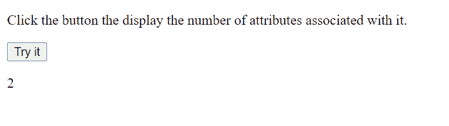
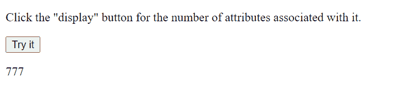

# HTML 中的属性和属性有什么区别？

> 原文:[https://www . geesforgeks . org/html 中属性和属性的区别是什么/](https://www.geeksforgeeks.org/what-is-the-difference-between-properties-and-attributes-in-html/)

**HTML** 是用于创建打算在网络浏览器上显示的文档的标准语言。在 JavaScript 中执行 DOM 对象操作时，很容易与属性混淆。在了解差异之前，让我们先定义文档对象模型。

**DOM:** 是[文档对象模型](https://www.geeksforgeeks.org/dom-document-object-model/)的缩写。当浏览器解析您的 HTML 代码时，它会创建一个相应的 DOM 节点。从该节点对象访问 HTML 属性。

简单来说，DOM 是 HTML 的一个 API，我们使用像 JavaScript 这样的语言或者像 React、Vue.js 这样的框架，使用相应的 DOM 对象来访问和操作 HTML。

**备注:**

1.  有些 DOM 属性没有对应的属性。
2.  有些 HTML 属性不具备对应的属性。
3.  一些 HTML 属性，像‘类’，拥有 1:1 到属性的映射。

让我们看一些快速的例子来演示属性和属性之间的区别。

**示例:**考虑下面的 HTML 代码片段。

## 超文本标记语言

```html
<!DOCTYPE html>
<html>

<body>
    <input id="input" type="number"
            value="Phone Number:">

    <p id="display"></p>

    <script>
        var element = document.getElementById("input");

        // Getting the property, returns "Phone Number:"
        window.alert(element.getAttribute("value"));

        element.value = 1234;
        var x = element.value;

        // Getting the attribute, returns "1234"
        document.getElementById("display").innerHTML
            = "Value Attribute: " + x;
    </script>
</body>

</html>         
```

**输出:**


现在，让我们考虑用户输入“1234”，那么*元素. getAttribute(“值”)*将返回*“电话号码:“*，因为我们已经提供了这个作为这个属性的初始值。但是*元素值*将返回*“1234”。*

因此，value 属性具有开发人员在 HTML 源代码中提供的初始文本内容，因为 value 属性反映了输入框内的当前文本内容(在本例中由用户提供)。

现在我们对差异有了一个基本的概念，让我们深入了解更多的差异。

**属性:**属性由 HTML 定义，用于自定义标签。

## 超文本标记语言

```html
<!DOCTYPE html>
<html>

<body>

<p>
        Click the button the display
        the number of attributes
        associated with it.
    </p>

    <button id="AttributeDemo"
        onclick="myFunction()">
        Try it
    </button>

    <p id="display"></p>

    <script>
        function myFunction() {
            var Attrdemo = document.getElementById(
                "AttributeDemo").attributes.length;

            document.getElementById(
                "display").innerHTML = Attrdemo;
        }
    </script>
</body>

</html>
```



输出为 2，因为这两个属性是: *id="AttributeDemo"* 和 *onclick="myFunction()"。*

**注意:***文档。属性*代码片段返回指定节点的属性集合，作为 NamedNodeMap 对象。为了访问节点，我们可以使用通用索引方法。替换上面代码片段中的下面一行。

## java 描述语言

```html
var Attrdemo = document.getElementById(
    'AtrributeDemo').attributes[1].name;
```

**输出:**

```html
onclick
```

属性的数据类型为字符串。所以不管属性值是什么，它总是会返回一个字符串。
**例:**

```html
document.getElementById('AtrributeDemo').getAttribute('id')
```

**输出:**

```html
AttributeDemo
```

**属性:**与 HTML 中定义的属性相反，属性属于 DOM。因为 DOM 是 JavaScript 中的一个对象，所以我们可以获取和设置属性。

## java 描述语言

```html
<!DOCTYPE html>
<html>

<body>

<p>
        Click the "display" button for
        the number of attributes
        associated with it.
    </p>

    <button id="AttributeDemo"
        onclick="myFunction()">
        Try it
    </button>

    <p id="display"></p>

    <script>
        function myFunction() {

            // Setting the property
            // 'geeksforgeeks' to a number
            document.getElementById('AttributeDemo')
                    .geeksforgeeks = 777;

            // Getting the property, returns 1
            var x = document.getElementById(
                'AttributeDemo').geeksforgeeks;

            document.getElementById(
                    "display").innerHTML = x;
        }
    </script>
</body>

</html>
```

**输出:**



当相应的属性改变时，默认属性(非用户定义的)改变，反之亦然。

## 超文本标记语言

```html
<!DOCTYPE html>
<html>

<body>

<p>
        Click the button the display the
        current className & the edited
        className
    </p>

    <button id="demo1" class="button"
        onclick="Function1()">
        Click Me
    </button>

    <p id="displayCurrent"></p>

    <p id="diplayEdited"></p>

    <script>
        function Function1() {
            var div = document.getElementById("demo1");

            // Returns  "GeeksForGeeks"
            window.alert("Current Class : "
                + div.getAttribute("class"));

            div.setAttribute("class", "GeeksForGeeks");

            // Returns : "GeeksForGeeks"           
            window.alert("Edited Class : "
                + div.getAttribute("class"));
        }
    </script>
</body>

</html>
```

**输出:**


**注:**

1.  非自定义属性(如 id、类等。)具有到属性的 1:1 映射。
2.  我们使用' className '来访问(获取或设置' class '属性，因为' class '是 JavaScript 中的保留关键字。
3.  定义了默认值的属性在相应的属性更改时保持不变。

**HTML 属性与 DOM 属性的区别:**

<figure class="table">

| attribute | attribute |
| --- | --- |
| Attributes are defined by HTML. | Attributes are defined by DOM. |
| The value of an attribute is constant. | The value of the property is variable. |
| These are all used to initialize DOM properties. After initialization, the job is completed.
 | There is no such job defined. |

</figure>