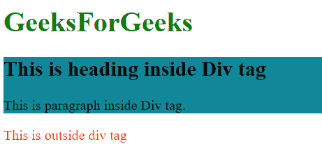
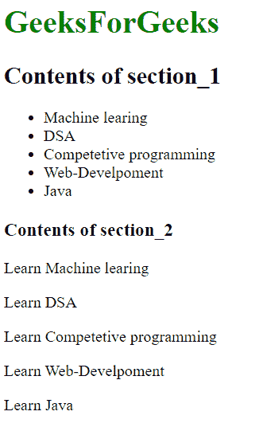

# HTML 中的

<section>和标签有什么区别？

> 原文: [https://www .极客们。org/section-and-div-tags-in-html/](https://www.geeksforgeeks.org/what-is-the-difference-between-section-and-div-tags-in-html/)

这两个标签([<>](https://www.geeksforgeeks.org/div-tag-html/)[<section>](https://www.geeksforgeeks.org/html-section-tag/#:~:text=Section%20tag%20defines%20the%20section,other%20section%20of%20documents%20needed.))都在网页中使用，< section > tag 表示里面的内容与一个主题相关，【T148

[**HTML<div>标签:**](https://www.geeksforgeeks.org/div-tag-html/) 它被称为分部标签。< div >标签是块级元素，只表示其子元素，没有特殊含义。它采用屏幕上可用的整个宽度。它通常与标题和类属性一起使用。< div >标签是网站创建中最常用的标签之一。将< div >元素用于样式目的，或者用于在一个都被赋予相似属性的部分中包装段落。也需要关闭< /div >标签。

**注:**建议使用< div >元素作为最后选项，并使用其他各种标签，如< main >、< article >或< nav >，因为这种做法对读者来说更方便。

**句法:**

```html
<div>
  <h1>Title</h1>
  <p>Information goes here....</p>
</div>
```

**例:**本例显示< div >标记。

## HTML

```html
<!DOCTYPE html>
<html>
  <head>
    <title>Div example</title>
  </head>
  <body>
    <h1 style="color:green">GeeksForGeeks</h1>
    <div style="background-color:#189">
      <h2>This is heading inside Div tag</h2>

<p>This is paragraph inside Div tag.</p>

    </div>

    <p style="color:red">This is outside div tag</p>

  </body>
</html>
```

**输出:**



[T57】HTML<节>标签:](https://www.geeksforgeeks.org/html-section-tag/)**T61<节>标签不是网页中的通用容器。<部分>标签中的内容将被分组，也就是说，它将连接到一个单一的主题，并作为一个条目出现在页面的大纲中。一个常见的规则是<部分>元素只有在文档大纲中明确列出该元素的内容时才有效。Section 标记用于分发具有相似主题的内容。区段标签的主要优点是，它在网页中描述了它的含义。当网页中需要页眉、页脚或文档的任何其他部分时，通常使用它。也需要关闭</部分>标签。**

**语法:**

```html
<section>
  <h1>Title</h1>
  <p>Information goes here....</p>
</section>
```

**示例:**此示例显示了<节>标记

## HTML

```html
<!DOCTYPE html>
<html>
  <head>
    <title>Title of the document</title>
  </head>
  <body>
    <h1 style="color:green">GeeksForGeeks</h1>
    <section>
      <h2>GeeksForGeeks </h2>
      <ul>
        <li>Machine learing</li>
        <li>DSA</li>
        <li>Competetive programming</li>
        <li>Web-Development</li>
        <li>Java</li>
      </ul>
    </section>
    <section>
      <h3>Books</h3>

<p>Learn Machine learing</p>

<p>Learn DSA</p>

<p>Learn Competetive programming</p>

<p>Learn Web-Development</p>

<p>Learn Java</p>

    </section>
  </body>
</html>
```

T78】输出:



**之间的差异 It is called section label. It represents its sub-element and has no special meaning. Represents its sub-elements and has special meaning. It doesn't have any specific meaning. Describe its meaning in the webpage. Use the < div > element in the web page for style purposes.**

**在要求页眉或页脚或任何**

 **其他章节文件时使用<章节>。** </section>