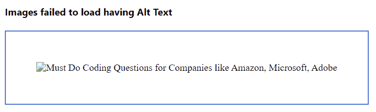

# HTML 中图像映射的替代文本有什么用？

> 原文:[https://www . geeksforgeeks . org/什么是替代文本-图像-映射-html/](https://www.geeksforgeeks.org/what-is-the-use-of-alternative-text-in-image-mapping-in-html/)

在本文中，我们将了解在图像无法正确加载的情况下，替代文本如何有助于提供与图像相关的元数据。加载不正确的原因可能是由于互联网连接速度慢、图像从网页中移除、图像的绝对路径没有给出，或者网站中的一些技术问题等。可选文本，有时在 HTML 中也称为 alt 属性，提供关于特定图像的元数据。alt 属性可以与 input> tag、 tag 和 tag 一起使用。当图像加载失败时，会出现此替代文本。这给出了关于那个特定图像的想法。

**语法:**

```html

```

**属性值:**它包含单值文本，用于在图像未显示时为支持的元素指定替代文本。

**示例 1:** 在本例中，图像路径包含图像以及 alt 文本，因此它将显示图像。

## 超文本标记语言

```html
<!DOCTYPE html>
<html>

<head>
    <title>Alternative Text</title>
</head>

<body>

<p>Image loaded</p>

    
</body>

</html>
```

**输出:**


**示例 2:** 在本例中，我们将看到 alt 文本丢失，图像加载失败的情况。

## 超文本标记语言

```html
<!DOCTYPE html>
<html>

<head>
    <title>Alternative Text</title>
</head>

<body>

<p>Image failed to load and alt text is missing</p>

    
</body>

</html>
```

**输出:**在这里，我们还没有为图片提供正确的绝对路径链接&也没有提供任何与图片相关的信息。


**示例 3:** 在本例中，我们将看到添加 alt 文本时&图像加载失败。

## 超文本标记语言

```html
<!DOCTYPE html>
<html>

<head>
    <title>Alternative Text</title>
</head>

<body>

<p>Image failed to load having alt text</p>

    
</body>

</html>
```

**输出:**这里，我们没有为图像提供正确的绝对路径链接，但是提供了替代文本。



**备选文本的使用:**

*   替代文本的第一个也是最基本的用途是提供元数据 ie。，一个图像描述。如果图像未加载或加载时间过长，用户会看到此文本。
*   对于搜索引擎，如谷歌、必应，有一个单独的图像选项卡，他们正在搜索每个网页，以找到每个关键词的相关图像。因此，他们不是从每个网页上阅读对他们来说很难的图像，而是使用替代文本来理解图像显示的内容。因此，因为替代文本，很容易搜索引擎更好地爬行和排名你的网站。
*   有一些人视力受损，看不懂网页。因此，他们使用屏幕阅读器，屏幕阅读器读出除图像以外的所有内容。因此，对于图像，替代文本有助于屏幕阅读工具描述图像，人们可以对特定的图像有所了解。