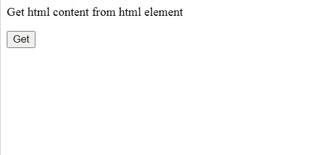
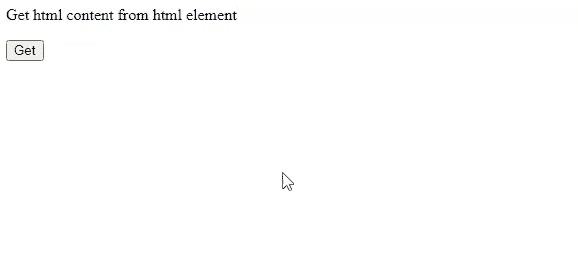
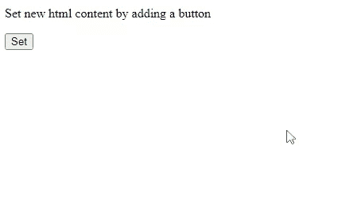
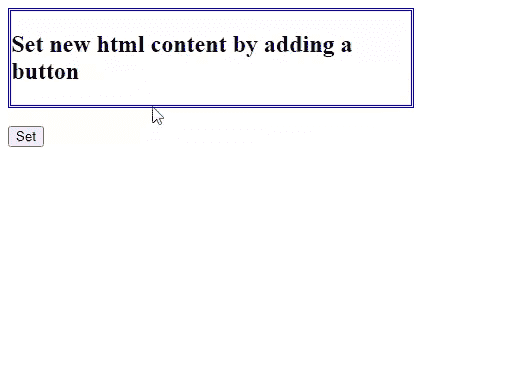

# html()方法在 jQuery 中有什么用？

> 原文:[https://www . geesforgeks . org/什么是 html-in-method-jquery/](https://www.geeksforgeeks.org/what-is-the-use-of-html-method-in-jquery/)

jQuery 中的 [html()方法](https://www.geeksforgeeks.org/jquery-html-method/)用于获取匹配元素集合中第一个元素的内容，或者用于设置每个匹配元素的 html 内容。它返回第一个匹配元素的内容。此函数不接受任何参数。

**语法:**

```html
$(selector).html();
```

**接近**:我们将创建一个 id 为&的按钮，将其值设置为 get。然后，我们将 jQuery 脚本编写为一条简单的警告消息，一旦用户单击“获取”按钮，该消息就会返回第一个匹配元素的 HTML 内容。

**示例:**在本例中，一旦用户单击将使用警报方法显示的按钮，我们将获得 [< div >标签](https://www.geeksforgeeks.org/div-tag-html/)的内容。

## 超文本标记语言

```html
<!DOCTYPE html>
<html>

<head>
    <script type="text/javascript" src=
"https://code.jquery.com/jquery-1.12.0.min.js">
    </script>

    <script>
        $(document).ready(function () {
            $("button").click(function () {
                alert($("div").html());
            });
        });
    </script>
</head>

<body>
    <div>

<p>Get html content from html element</p>

    </div>
    <button id="get">Get</button>
</body>

</html>
```

**输出:**



**将 HTML 元素转换为文本:**

**方法:**我们正在创建一个值为 Get 的按钮。然后我们编写 jQuery 脚本，将 HTML 的内容(即 firstDiv 元素)转换成字符串，并在段落元素中显示。在这个例子中，我们得到了第一个 Div 元素的完整的 HTML 内容。

**示例:**在这个示例中，我们正在获取 div 元素的内容。我们有两个 div 标签，只返回第一个匹配元素的内容。

## 超文本标记语言

```html
<!DOCTYPE html>
<html>

<head>
    <script type="text/javascript" src=
"https://code.jquery.com/jquery-1.12.0.min.js">
    </script>

    <script>
        $(document).ready(function () {
            $("button").click(function () {
                var str = $("div.firstDiv").html();
                $("p").text(str);
            });
        });
    </script>
</head>

<body>
    <div class="firstDiv">
        <div class="secondDiv">

<p>Get html content from html element</p>

        </div>
    </div>
    <button id="get">Get</button>
</body>

</html>
```

**输出:**



**设置 HTML 的内容:**

**语法:**

它设置匹配元素的内容。

```html
$(selector).html(content)
```

它使用函数设置内容。

```html
$(selector).html(function(index, currentcontent))
```

**参数:**该方法接受两个参数，如上所述，如下所述:

*   **内容:**是为所选元素指定新内容的强制参数。
*   **函数(index，currentcontent):** 它是一个可选参数，用于指定返回所选元素新内容的函数。
    *   **索引:**用于返回元素在集合中的索引位置。
    *   **currentcontent:** 用于返回当前选中元素的 HTML 内容。

**接近**:我们正在用值集创建一个按钮。然后我们编写 jQuery 脚本，设置第一个匹配元素的内容，即第一个 Div 元素。fisrtDiv 的完整代码，即第一个 Div 元素将被更改为“新的 HTML 内容和极客”。请注意，我们在 HTML 的更新内容中使用了< h1 >和< h2 >标签。

**示例:**在本例中，我们使用第一种语法设置了用户单击按钮 Set 后 div 元素的内容。

## 超文本标记语言

```html
<!DOCTYPE html>
<html>

<head>
    <script type="text/javascript" src=
"https://code.jquery.com/jquery-1.12.0.min.js">
    </script>

    <script>
        $(document).ready(function () {
            $("button").click(function () {
                $("div").html(
"<h1>New HTML Content</h1> <h2>GeeksforGeeks</h2>");
            });
        });
    </script>
</head>

<body>
    <div class="firstDiv">
        <div class="secondDiv">

<p>Set new html content by adding a button</p>

        </div>
    </div>
    <button>Set</button>
</body>

</html>
```

**输出:**



**接近**:我们正在用值集创建一个按钮。然后我们编写 jQuery 脚本，该脚本使用函数设置第一个匹配元素的内容，即第一个 Div 元素。fisrtDiv 的完整代码，即第一个 Div 元素将被更改为“旧内容为:通过添加索引为 0 的按钮设置新的 HTML 内容现已更改”。该函数有两个参数，即索引值和字符串形式的旧内容。正如您在输出中看到的，我们正在使用这些值并更新旧内容。

**示例:**在本例中，我们正在设置用户单击按钮 Set 后第一个 Div 元素的内容。我们只是返回一条消息，并打印收到的索引值。

## 超文本标记语言

```html
<!DOCTYPE html>
<html>

<head>
    <script type="text/javascript" src=
"https://code.jquery.com/jquery-1.12.0.min.js">
    </script>

    <style>
        .firstDiv {
            width: 400px;
            border-color: blue;
            border-width: 0.2em;
            border-style: double;
        }
    </style>

    <script>
        $(document).ready(function () {
            $("button").click(function () {
                $("div").html(function (i, str) {
                    return (
                        "<h2>Old content is:</h2>" +
                        str +
                        "<h2>with index</h2>" +
                        i +
                        "<h2>is now changed</h2>"
                    );
                });
            });
        });
    </script>
</head>

<body>
    <div class="firstDiv">
        <div class="secondDiv">
            <h2>
                Set new html content 
                by adding a button
            </h2>
        </div>
    </div>
    <br />
    <button>Set</button>
</body>

</html>
```

**输出:**

