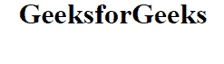

# HTML 中的“no-js”类有什么用？

> 原文:[https://www . geeksforgeeks . org/html 中的 no-js-class 是什么用法/](https://www.geeksforgeeks.org/what-is-the-use-of-the-no-js-class-in-html/)

**目的:**

*   **no-js** 类的主要目的是允许使用 CSS 为无 JavaScript 的页面设置样式，即为启用了 JavaScript 的浏览器以及禁用了 JavaScript 的浏览器定义 CSS 样式。
*   因此，“no-js”类只有在 JavaScript 被禁用的情况下才会出现。这使得能够在不使用任何客户端脚本的情况下设计纯 HTML 和 CSS 页面。
*   但是如果启用了 JavaScript，它会自动移除“no-js”类。
*   默认情况下，标记中提供了“no-js”类。
*   “no-js”类基本上是一种能够在使用或不使用 JavaScript 的情况下设置样式的方法。
*   “no-js”类被添加到作为 Modernizr 指令的最顶端的 html 元素中。

**语法:**

```html
<!--[if (gt IE 9)|!(IE)]><!--> <html lang="en" class="no-js"> <!--<![endif]-->
```

**示例:**

```html
<!DOCTYPE html>
<html class="no-js">

<head>
    <script>document.documentElement.className
        = document.documentElement.className
        .replace(/\bno-js\b/g, '') + ' js ';
    </script>

    <!-- Other files and libraries
        to be included -->
    <head>

    <body>
        <center>
            <h1>GeeksforGeeks</h1>
        </center>
    </body>

</html>
```

**输出:**
