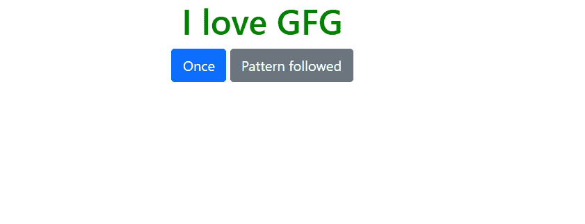
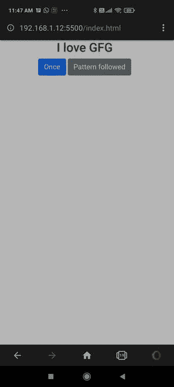

# html 5 中的振动 API 是什么？

> 原文:[https://www . geesforgeks . org/什么是振动-api-in-html5/](https://www.geeksforgeeks.org/what-is-the-vibration-api-in-html5/)

振动是一种引发用户好奇心的感觉，并倾向于让他们执行任务。例如，在健身追踪器中，振动提醒提醒用户他们是否已经坐了太长时间，这可能会使他们散步或离开桌子，或者电话或智能手表中的振动会触发用户查看消息提醒或接听电话。

[振动应用编程接口](https://www.geeksforgeeks.org/web-vibration-api-navigator-vibrate-method/)通过访问软件的硬件来做到这一点，如果它存在的话。同样在浏览器中也支持 HTML5，在 PC 上只支持火狐、Chrome、微软 Edge，在移动设备上支持 Chrome、安卓、Opera、三星互联网微弱。实际上，该功能仅在移动设备上受支持。

**示例:**

## 超文本标记语言

```html
<!DOCTYPE html>
<html>
  <head>
    <!-- Include the Bootstrap CDN -->
    <link
      href=
"https://cdn.jsdelivr.net/npm/bootstrap@5.0.2/dist/css/bootstrap.min.css"
      rel="stylesheet" />
  </head>
  <body style="text-align: center">
    <h1 style="color: green">I love GFG</h1>

    <!-- Add button for a single vibration -->
    <button type="button" 
             class="btn btn-primary"
             onclick="vibrate1(1000)">
        Once
    </button>

    <!-- Add button for vibration pattern -->
    <button type="button" 
            class="btn btn-secondary" 
             onclick="vibrate2()">
        Pattern followed
    </button>

    <script>
      function vibrate1(milli) {

        // Vibrates once for the number of 
        // milliseconds passed as the argument
        navigator.vibrate(milli);
      }
      function vibrate2() {

        // Vibrates in a pattern by 
        // according to the given array
        navigator.vibrate(
          [400,150,300,120,200]
        );
      }
    </script>
  </body>
</html>
```

**输出:**



要在手机上访问本地站点，请找到您的 IP 地址，并在手机浏览器中打开以下链接:

```html
http://<your ip address>:<port>/index.html
```

在 Windows 上使用 **ipconfig** 命令，在 Linux 上使用 **ifconfig** 命令，就可以找出自己的实际 IP 地址。

现在，在您的移动浏览器上打开它，您可以访问按钮并体验振动应用编程接口的功能。

