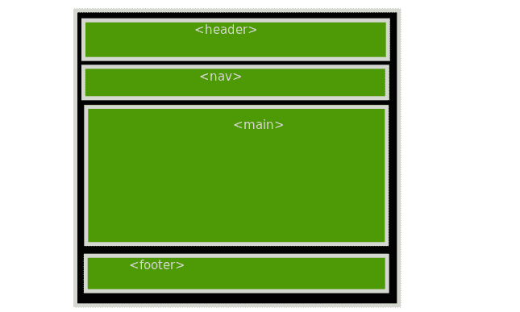
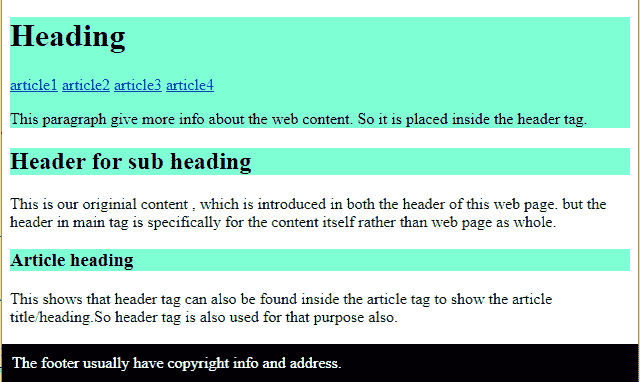
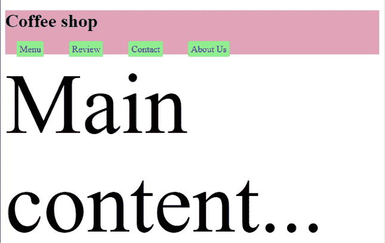

# HTML 文档的页眉通常包含哪些内容？

> 原文:[https://www . geesforgeks . org/html 文档标题中通常包含的内容/](https://www.geeksforgeeks.org/what-is-usually-included-in-the-header-of-an-html-document/)

[<表头>](https://www.geeksforgeeks.org/html-5-header-tag/) 是 HTML5 中引入的标签。在本文中，我们将讨论*标题*标签的用例，以及通常包含在 HTML 文档标题中的内容。HTML5 想出了<表头>，表头的概念在 HTML4 中也有。程序员用“头”的 id 创建一个 HTML[<>](https://www.geeksforgeeks.org/div-tag-html/)div 来指定它是头。

**语法:**

```html
<div id="header"></div>
```

在 HTML5 中，我们有

<header>标签以及像 [<【主】>](https://www.geeksforgeeks.org/html-main-tag/)[<页脚>](https://www.geeksforgeeks.org/html5-footer-tag/) 等标签。</header>



标题网页结构

[**HTML5 <页眉>标签:**](https://www.geeksforgeeks.org/html-5-header-tag/) 在我们的普通笔记本中，我们使用页面最上面的部分作为标题或页眉。我们在那一页上指定内容的标题。<头>标签一般用于保存关于内容的信息。它通常在网站的 *<主>* 部分给用户关于页面实际是为了什么以及用户可以期待什么的信息。

*<表头>* 标签一般用于标题目的，你可能会看到这些表头标签< h1 >到< h6 >的使用。 [<导航>](https://www.geeksforgeeks.org/html-nav-tag/) 标签在 *<标题>* 标签中使用。如果<导航>非常小，并且如果<导航>标签的内容用于识别不同的网页内容，这可能会发生。在这种情况下，<导航>通常位于<标题>标签内。

如果我们的网页 *<主>* 有多个不同内容的部分，那么每个部分也可以有各自独立的 *<标题>* 标签来保存特定部分的信息。

**标题标签:**

*   [<h1><H2><H3><H4><H5><h6>T1】](https://www.geeksforgeeks.org/html-heading/)
*   [< p >](https://www.geeksforgeeks.org/html-paragraph/) 标签为介绍信息
*   [< img >](https://www.geeksforgeeks.org/html-images/) 标签为标志/图标
*   [<导航>](https://www.geeksforgeeks.org/html-nav-tag/) 标签

**我们可以/不可以在哪里使用<头>标签？**

由于表头用于标题目的，不能用在<页脚>中，但可以用在<主>标签中，用于描述不同的章节，如我们<主>中的每个<文章>标签。

**例 1:**

## 超文本标记语言

```html
<!DOCTYPE html>
<html lang="en">

<head>
    <meta charset="UTF-8">
    <meta http-equiv="X-UA-Compatible" content="IE=edge">
    <meta name="viewport" content=
        "width=device-width, initial-scale=1.0">

    <style>
        header {
            background-color: aquamarine;
        }

        footer {
            color: white;
            background-color: black;
            padding: 10px;
            position: fixed;
            bottom: 0;
            width: 100%;
            left: 0;
        }
    </style>
</head>

<body>
    <header>
        <h1>Heading</h1>
        <a href="#">article1</a>
        <a href="#">article2</a>
        <a href="#">article3</a>
        <a href="#">article4</a>

<p>
            This paragraph give more info
            about the web content. So it
            is placed inside the header tag.
        </p>

    </header>

    <main>
        <header>
            <h2>Header for sub heading</h2>
        </header>

<p>
            This is our original content, which
            is introduced in both the header of
            this web page. but the header in main
            tag is specifically for the content
            itself rather than web page as whole.
        </p>

        <article>
            <header>
                <h3>Article heading</h3>
            </header>

<p>
                This shows that header tag can
                also be found inside the article
                tag to show the article title/
                heading. So header tag is also
                used for that purpose also.
            </p>

        </article>
    </main>

    <footer>
        The footer usually have copyright
        info and address.
    </footer>
</body>

</html>
```

**输出:**



**示例 2:** 请参见下面的示例，了解标题的确切用途。我们还可以在标题中包含导航栏，因为它也是网页的重要部分，定义了内容的结构，并在页面的不同部分导航。因此，它也可以放在标题标签中。

## 超文本标记语言

```html
<!DOCTYPE html>
<html lang="en">

<head>
    <meta charset="UTF-8">
    <meta http-equiv="X-UA-Compatible" content="IE=edge">
    <meta name="viewport" content=
        "width=device-width, initial-scale=1.0">

    <style>
        header {
            width: 100%;
            height: 10%;
            background-color: #E1A2B8;
        }

        nav {
            color: white;
        }

        a {
            text-decoration: none;
            background-color: lightgreen;
            padding: 5px;
            border-radius: 5%;
            margin: 20px;
        }

        main {
            font-size: 150px;
        }
    </style>
</head>

<body>
    <header>
        <h1>Coffee shop</h1>
        <nav>
            <a href="#">Menu</a>
            <a href="#">Review</a>
            <a href="#">Contact</a>
            <a href="#">About Us</a>
        </nav>
    </header>

    <main>
        Main content...
    </main>
</body>

</html>
```

**输出:**



**注意:**默认<表头>标签为*显示:屏蔽*。