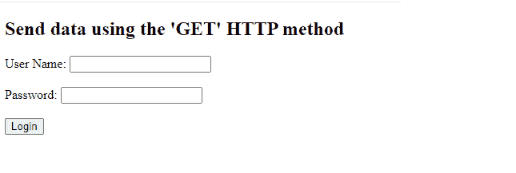
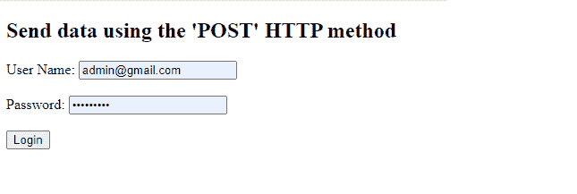

# 表单数据用哪种 HTTP 方式发送？

> 原文:[https://www . geeksforgeeks . org/哪个-http-method-被用来发送表单数据/](https://www.geeksforgeeks.org/which-http-method-is-used-to-send-the-form-data/)

在本文中，我们将学习发送表单数据的 HTTP 方法。在深入这个主题之前，我们需要知道 HTTP 方法到底是什么，以及有多少 HTTP 方法可用。

**什么是** [**HTTP**](https://www.geeksforgeeks.org/http-full-form/) **？**

HTTP 代表超文本传输协议。它用于客户端和服务器之间的通信。它在客户机和服务器之间的请求-响应协议上工作。客户端向服务器发送请求。服务器接受请求并向客户端返回响应。它可以是关于请求和请求内容的信息。

以下是最常用的 [HTTP 方法](https://www.geeksforgeeks.org/http-get-post-methods-php/)。

*   得到
*   邮政

在客户端验证表单后，就可以提交表单了。提交后，表单数据使用 GET 方法和 POST 方法发送到服务器。一旦我们将使用 GET 方法向服务器发送表单数据，那么我们将使用 POST 方法向服务器发送表单数据。最后，我们将了解用于发送表单数据的两种 HTTP 方法之间的区别。

**使用“GET”HTTP 方法发送表单数据:**GET 方法用于从指定的资源请求数据。它向服务器发送一个空体，并请求获取资源。如果表单数据是使用 GET 方法发送的，则服务器发送的数据会附加到页面的 URL。它的请求有一些长度限制。它不用于修改。

**示例:**

## 超文本标记语言

```html
<!DOCTYPE html>
<html>

<body>
    <h1>Send data using the 'GET' HTTP method</h1>
    <form action="" method="get" target="_blank">
        <label>User Name:</label>
        <input type="text" id="username" 
            name="User Name"><br><br>

        <label>Password:</label>
        <input type="password" id="password" 
            name="Password"><br><br>
        <input type="submit" value="Login">
    </form>
</body>

</html>
```

**输出:**



**使用“POST”HTTP 方法发送表单数据:**POST 方法用于向服务器发送数据，以创建和更新资源。使用 POST 方法请求的数据被附加到 HTTP 请求的正文，而不是页面 URL。它的请求对数据长度没有限制。

**示例:**

## 超文本标记语言

```html
<!DOCTYPE html>
<html>

<body>
    <h2>Send data using the 'POST' HTTP method</h2>

    <form action="" method="post" target="_blank">
        <label>User Name:</label>
        <input type="text" id="username" 
            name="User Name"><br><br>

        <label>Password:</label>
        <input type="password" id="password" 
            name="Password"><br><br>
        <input type="submit" value="Login">
    </form>
</body>

</html>
```

**输出:**

