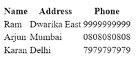
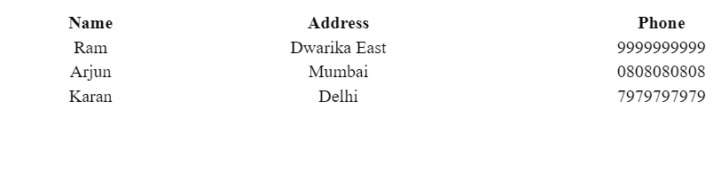

# 哪些标签用于在 HTML 中以表格形式显示数据？

> 原文:[https://www . geesforgeks . org/哪些标签用于以 html 表格形式显示数据/](https://www.geeksforgeeks.org/which-tags-are-used-to-displaying-data-in-tabular-form-in-html/)

在本文中，我们将讨论用于以表格形式显示数据的标签。

**标签:**标签是 HTML 元素的开始和结束部分。每个标签都以“<”符号开始，以“>”符号结束。这些符号里面的东西叫做标签。开始和结束标签用于存储标签内的任何信息。

开始标签用 **<标签名>** 表示，结束标签用**</标签名>** 表示。

**语法:**

```html
<table> INFORMATION INSIDE THE TAG </table>
```

**属性:**属性用于描述 HTML 元素的特征。所有的 HTML 元素都可以有属性。属性有两个参数，名称和值，用于定义元素的属性，这些参数位于元素的开始标记下。

**语法:**

```html
<tag_name attribute_name="attribute_value">
    DATA INSIDE THE TAG
</tag_name>
```

**注意:**请参考 HTML [属性](https://www.geeksforgeeks.org/html-attributes/)文章，以便更好的理解。

用于在 HTML 中创建表格的标签有:

*   **[表格](https://www.geeksforgeeks.org/html-tables/) :** 在 HTML 中“表格”标签是用来定义表格的。
*   **[tr](https://www.geeksforgeeks.org/html-tr-tag/) :** 用于定义表格行，使用“tr”标记。
*   **[th](https://www.geeksforgeeks.org/html-th-tag/):**“th”代表一个表头，用于定义表头的“th”标记。表格标题是粗体和居中的。
*   **[【td】](https://www.geeksforgeeks.org/html-td-tag/):要在每个单元格中插入或添加数据，使用表格数据“TD”标签。**

**方法:**现在要使用上述标签和属性以表格形式显示数据，我们将遵循以下步骤:

*   在正文标签下创建一个表格标签。
*   要定义行，请在表下添加表行标签。
*   对于表格标题，在特定行中使用表格标题(第)标记。
*   要向表中添加数据，请创建一行，并使用“td”标记在每行中插入数据。

下面是上述方法的实现。

**示例 1:** 在本例中，我们将创建一个简单的表格并显示它**，而不使用任何属性**。

## index.html

```html
<!DOCTYPE html>
<html lang="en">

<body>
    <table>
        <tr>
            <th>Name</th>
            <th>Address</th>
            <th>Phone</th>
        </tr>
        <tr>
            <td>Ram</td>
            <td>Dwarika East</td>
            <td>9999999999</td>
        </tr>
        <tr>
            <td>Arjun</td>
            <td>Mumbai</td>
            <td>0808080808</td>
        </tr>
        <tr>
            <td>Karan</td>
            <td>Delhi</td>
            <td>7979797979</td>
        </tr>
    </table> 
</body>

</html>
```

**输出:**



**示例 2:** 在本例中，我们将创建一个带有属性的表格，并将使用 style 属性来显示覆盖整个宽度的内容，并将文本对齐在表格的中心。

## index.html

```html
<!DOCTYPE html>
<html lang="en">

<body>
    <table style="width:100%; text-align:center">
        <tr>
            <th>Name</th>
            <th>Address</th>
            <th>Phone</th>
        </tr>
        <tr>
            <td>Ram</td>
            <td>Dwarika East</td>
            <td>9999999999</td>
        </tr>
        <tr>
            <td>Arjun</td>
            <td>Mumbai</td>
            <td>0808080808</td>
        </tr>
        <tr>
            <td>Karan</td>
            <td>Delhi</td>
            <td>7979797979</td>
        </tr>
    </table> 
</body>

</html>
```

**输出:**

