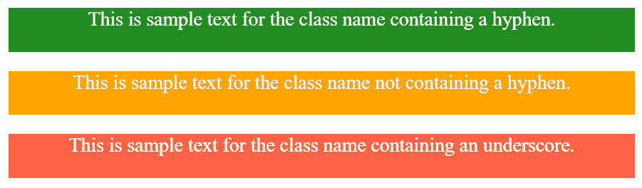

# 为什么 CSS 选择器/ HTML 属性首选破折号？

> 原文:[https://www . geesforgeks . org/why-is-breaks-preferred-for-CSS-selecters-html-attributes/](https://www.geeksforgeeks.org/why-are-dashes-preferred-for-css-selectors-html-attributes/)

CSS 是一种**连字符分隔的语法语言**，这意味着在编写 HTML 属性时，我们可以使用连字符(-)。

**示例:**

```html
font-size, line-height, background-color, etc...
```

选择连字符(-)有各种原因:

*   在 CSS 中，可以用下划线(_)代替连字符(-)来表示 CSS 选择器(类、id、span、…)，但首选项是基于它的易用性给出的。
*   下划线需要按 Shift 键，因此更难键入。另一方面，CSS 已经使用连字符或破折号作为其官方代码的一部分，因此使用连字符比使用下划线更方便。
*   除了使用破折号，我们还可以使用 camel case 来书写，但是它有一些问题需要使用，比如它更难阅读，单词之间的空白使它们更容易阅读。
*   使用破折号还有一个好处，它使代码更易读。

**示例:**

```html
<!DOCTYPE html>
<html lang="en" dir="ltr">

<head>
    <meta charset="utf-8">

    <title>
        Why are dashes preferred
        for CSS selectors / HTML
        attributes ?
    </title>

    <style media="screen">
        .Geeks-for-Geeks-Example-1{
            background-color: forestGreen;
            color: white;
            height: 10vh;
            text-align: center;
            font-size: 4.5vh;
        }
        .GeeksforGeeksExample2{
            background-color: Orange;
            color: white;
            height: 10vh;
            text-align: center;
            font-size: 4.5vh;
        }
        .Geeks_for_Geeks_Example_3{
            background-color: tomato;
            color: white;
            height: 10vh;
            text-align: center;
            font-size: 4.5vh;
        }
    </style>
</head>

<body>

    <!-- Easy to read and write class name -->
    <div class="Geeks-for-Geeks-Example-1">
        This is sample text for the class
        name containing a hyphen.
    </div>
    <br>

    <!-- Difficult to read class name -->
    <div class="GeeksforGeeksExample2">
        This is sample text for the class
        name not containing a hyphen.
    </div>
    <br>

    <!-- Difficult to write class name -->
    <div class="Geeks_for_Geeks_Example_3">
        This is sample text for the class
        name containing an underscore.
    </div>
</body>

</html>
```

**输出:**


从上面的代码中，很明显使用破折号是一种更合适的编写程序的方式，而不是使用骆驼大小写或下划线，因此，由于这个事实，破折号是 CSS 选择器/HTML 属性的首选。