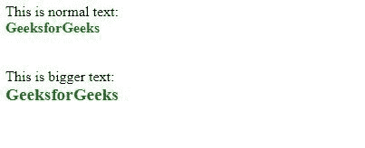
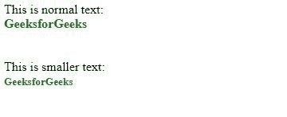

# 为什么<big>标签不在 HTML5 中而<small>标签存在？</small></big>

> 原文:[https://www . geesforgeks . org/why-大标签不在 html5 中-而小标签存在/](https://www.geeksforgeeks.org/why-big-tag-is-not-in-html5-while-small-tag-exists/)

& T0；lt；大的>标签在 HTML5 中已经停产，而小的[标签<小的>标签](https://www.geeksforgeeks.org/html-small-tag/)仍然可以派上用场，因为<小的>标签经常被用来表示脚注、版权声明、评论等小的印刷品。很多<大>标签的替代品已经有了，比如< h1 >、< h2 >等等。在 HTML5 中不使用<大>，可以使用 CSS 创建更大的文本。

**<大>标签:**HTML<大>标签使 HTML 文档中的字体变大了一个尺寸。小的转换成中的，中的转换成大的，同样大的转换成 x-大的。

**语法:**

```html
<big> Text... </big>
```

**示例:**

```html
<!DOCTYPE html>
<html>

<head>
    <style>
        div {
            font-weight: bold;
            color: green;
        }
    </style>
</head>

<body>
    This is normal text:
    <div>GeeksforGeeks</div>
    <br></br>
    This is bigger text:
    <div><big>GeeksforGeeks</big></div>
</body>

</html>
```

**输出:**


**<小>标签:**HTML<小>标签定义了更小的文本。它使文本比可用文本小一种字体。x-large 转换为大，large 转换为中，类似地，medium 转换为 small。

**语法:**

```html
<small> Text... </small>
```

**示例:**

```html
<!DOCTYPE html>
<html>

<head>
    <style>
        div {
            font-weight: bold;
            color: green;
        }
    </style>
</head>

<body>
    This is normal text:
    <div>GeeksforGeeks</div>
    <br></br>

    This is smaller text:
    <div><small>GeeksforGeeks</small></div>
</body>

</html>
```

**输出:**


<big>和<small>标签具有以下浏览器支持:</small></big>

*   谷歌 Chrome
*   火狐浏览器
*   微软公司出品的 web 浏览器
*   歌剧
*   旅行队