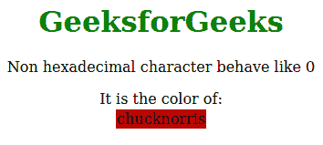

# 为什么在 HTML 中使用“chucknorris”作为颜色？

> 原文:[https://www . geeksforgeeks . org/why-chucknorris-is-as-color-in-html/](https://www.geeksforgeeks.org/why-chucknorris-is-used-as-a-color-in-html/)

HTML 接受非十六进制字符为 0，所以我们都知道 0-9 定义 0 到 9，然后 A-F 定义 10 到 15。所以有太多的词可以像 **chucknorris** 这样的颜色，像这样的深红色。

|  |

如果您在 **bgcolor** 中放入任何包含几个十六进制字符的单词，那么该字符将显示一些您从未想象过的意外颜色。就像 **#F00F00** 等于**# FoT**。但这只会在表格标签内的 **bgcolor** 上起作用，在其他地方不起作用。

**chucknorris = c00c 000000**以十六进制表示，在此之后，它将其分成三个相等的组，如**c00c 000000000**，然后它将从右向下截断为两个字符，使**的 RGB 颜色(c0，00，00)** 与**的 RGB 颜色(198，0，0)** 相同，即血红色。

下面的例子说明了这个概念:

**示例:**

```html
<!DOCTYPE html>
<html>
<head>
    <title>
        Why “chucknorris” is used
        as a color in HTML ?
    </title>
    <style>
        h1 {
            color: green;
        }
    </style>
</head>

<body>
    <center>
        <h1>GeeksforGeeks</h1>
        <p>
          Non hexadecimal character behave like 0
        </p>
        <table>
            It is the color of:
            <td bgcolor="chucknorris">
              chucknorris
            </td>
        </table>
    </center>
</body>

</html>
```

**输出:**


如果你试着去创造，还有很多其他的颜色可以创造。基本规则是单词必须在十六进制转换中包含至少一个介于 **A-F** 之间的字符，如**草**、**废话**、 **chucknorr** 、 **khoocnocr** 和 **mrt** 。您可以自己创建，但这不是选择十六进制的正确过程。

**支持的浏览器:**本程序支持的浏览器如下:

*   谷歌 Chrome
*   微软公司出品的 web 浏览器
*   火狐浏览器
*   歌剧
*   旅行队