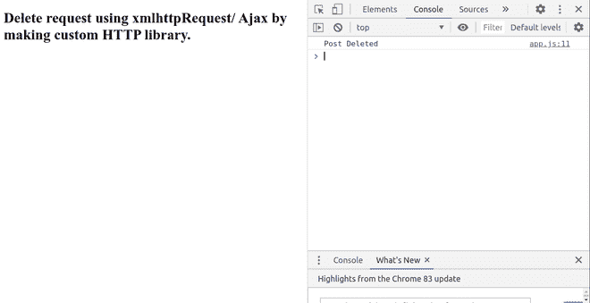

# 通过创建自定义 HTTP 库

使用 XMLHttpRequest 删除请求

> 原文:[https://www . geesforgeks . org/delete-request-use-xmlhttprequest-by-making-custom-http-library/](https://www.geeksforgeeks.org/delete-request-using-xmlhttprequest-by-making-custom-http-library/)

这里的任务是展示如何使用 **XMLHttpRequest** 通过创建一个定制的 HTTP 库来将**数据删除到一个应用编程接口。包含对象数组的占位符应用编程接口将被用作示例。删除请求在此应用编程接口上执行。API 的网址是[https://jsonplaceholder.typicode.com/posts/](https://jsonplaceholder.typicode.com/posts/5)**

**先决条件:**

*   需要基本的 HTML、CSS 和 JavaScript 知识。
*   必须创建一个 HTML 文件，其中添加了基本的 HTML 标记，如下例所示。在正文的最后，我们附加了两个脚本，分别是 library.js 和 app.js。然后我们将创建这些文件。

#### 创建 library.js 文件:

1.  首先创建一个函数 **easyHTTP** ，并初始化一个新的 **XMLHttpRequest()** 对象。
2.  使用**easyhttp . prototype . delete .**为删除方法创建了一个新的原型，它包含两个参数 **url** 和一个**回调。**
3.  使用**打开**方法打开新请求。它需要三个参数，第一个是请求的**类型**(GET、POST、PUT 或 DELETE)，第二个是 API 的 **URL** ，最后一个是布尔值，其中**真**表示**异步**调用，**假**表示**同步**调用。
4.  **onload** 处理程序用于显示数据。它在 API 调用完成后执行。检查响应的状态。如果状态代码为 **200** ，则运行回调函数，该函数包含两个参数，**错误**和**响应**文本。如果状态代码是**而不是 200** ，那么回调函数将简单地打印错误消息。
5.  最后一步是使用 **send()** 功能发送请求。

#### 创建 app.js 文件:

1.  我们将首先实例化早先使用**新**关键字创建的 **easyHTTP** 。
2.  然后我们在删除原型函数中传递 **URL** 和一个**回调**函数。
3.  **回调**函数将包含两个参数，即出现错误时打印**错误**和得到实际响应的**响应**。

下面的代码示例演示了所有必需文件的创建。

#### index.html 代码

## 超文本标记语言

```html
<!DOCTYPE html>
<html lang="en">
<head>
  <title>Delete request</title>
</head>
<body>
  <h1>
    Delete request using xmlhttpRequest/
    Ajax by making custom HTTP library.
  </h1>

  <!-- Including library.js and
  app.js files -->
  <script src="library.js"></script>
  <script src="app.js"></script>
</body>
</html>
```

#### library.js 的代码

## java 描述语言

```html
function easyHTTP() {
  // Initialising new XMLHttpRequest method.
  this.http = new XMLHttpRequest();
}

// Make an HTTP Delete Request
easyHTTP.prototype.delete
  = function (url, callback) {

  // Open an request (GET/POST/PUT/DELETE,
  // PATH, ASYNC - TRUE/FALSE)
  this.http.open("DELETE", url, true);

  // Assigning this to self to have
  // scope of this into the function
  let self = this;

  // When the response is ready
  this.http.onload = function () {

    // Checking status
    if (self.http.status === 200) {

      // Callback function (Error, response text)
      callback(null, "Post Deleted");
    } else {

      // Callback function (Error message)
      callback("Error: " + self.http.status);
    }
  };

  // Send the request
  this.http.send();
};
```

#### app.js 的代码

## java 描述语言

```html
// Instantiate easyHTTP
const http = new easyHTTP();

// Use the delete prototype
// method with (URL, callback(error, response text))
http.delete("https://jsonplaceholder.typicode.com/posts/1",
 function (
  err,
  response
) {
  if (err) {
    console.log(err);
  } else {
    console.log(response);
  }
});
```

**输出:**

在任意浏览器中打开**index.htm**l 文件，打开开发者控制台。程序的输出将在这里可见。也可以使用网络选项卡查看**删除**请求及其详细信息。

