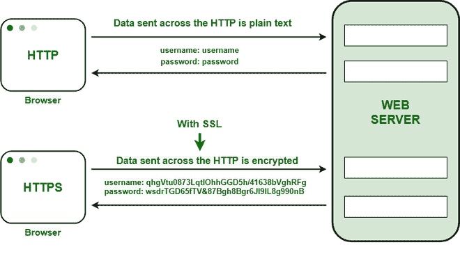

# 说明 HTTPS

的工作情况

> 原文:[https://www.geeksforgeeks.org/explain-working-of-https/](https://www.geeksforgeeks.org/explain-working-of-https/)

### 什么是 HTTPS？

HTTPS 代表超文本传输协议安全。它是在网络浏览器和网站之间发送数据的最常见协议。它是 HTTP 的安全变体，用于浏览器和网络服务器之间的通信。为了使数据传输更安全，它被加密了。传输密码、联系信息等敏感信息时，需要加密来确保安全。

### HTTPS 是如何运作的？

HTTPS 建立了浏览器和网络服务器之间的通信。它使用**安全套接字层** (SSL)和**传输层安全** (TLS)协议来建立通信。SSL 的新版本是 TSL。

HTTPS 使用传统的 HTTP 协议，并在其上增加了一层 SSL/TSL。HTTP 和 HTTPS 的[工作流程保持不变，浏览器和服务器仍然使用 HTTP 协议相互通信。但是，这是通过安全的 SSL 连接完成的。SSL 连接负责对正在交换的数据进行加密和解密，以确保数据安全。](https://www.geeksforgeeks.org/understanding-http-using-browsers/)

#### 安全套接字层

SSL 的主要职责是确保通信系统之间的数据传输**安全可靠**。它是标准的安全技术，用于在请求传输期间对数据进行加密和解密。

如前所述，HTTPS 基本上是相同的旧 HTTP，但 SSL。为了在通信设备之间建立安全的通信链路，SSL 使用名为 **SSL 证书**的数字证书。

SSL 层有两个主要角色–

*   确保浏览器直接与所需的服务器通信。
*   确保只有通信系统可以访问它们交换的消息。

HTTP 以超文本格式在浏览器和网络服务器之间传输数据，而 HTTPS 以加密格式传输数据。因此，HTTPS 保护网站信息不被任何窃听网络的人轻易看到。在浏览器和网络服务器之间的传输过程中，HTTPS 保护数据不被黑客访问和篡改。即使传输被拦截，黑客也无法使用，因为消息是加密的。

它使用非对称公钥基础设施来保护通信链路。有两种不同类型的密钥用于加密–

1.  **私钥**:用于对已经用公钥加密的数据进行解密。它位于服务器端，由网站所有者控制。它本质上是私有的。
2.  **公钥**:本质上是公共的，与服务器通信的所有用户都可以访问。私钥用于解密已由公钥加密的数据。

### HTTPS 的优势

1.  **安全通信:** HTTPS 通过在传输期间提供加密，在通信系统之间建立安全通信链路。
2.  **数据完整性:**通过加密数据，HTTPS 确保了数据的完整性。这意味着，即使数据在任何时候遭到破坏，黑客也无法读取或修改正在交换的数据。
3.  **隐私和安全:** HTTPS 防止攻击者被动访问正在交换的数据，从而保护用户的隐私和安全。
4.  **更快的性能:** TTPS 加密数据并减小其大小。在 HTTPS 的情况下，较小的尺寸导致更快的数据传输。