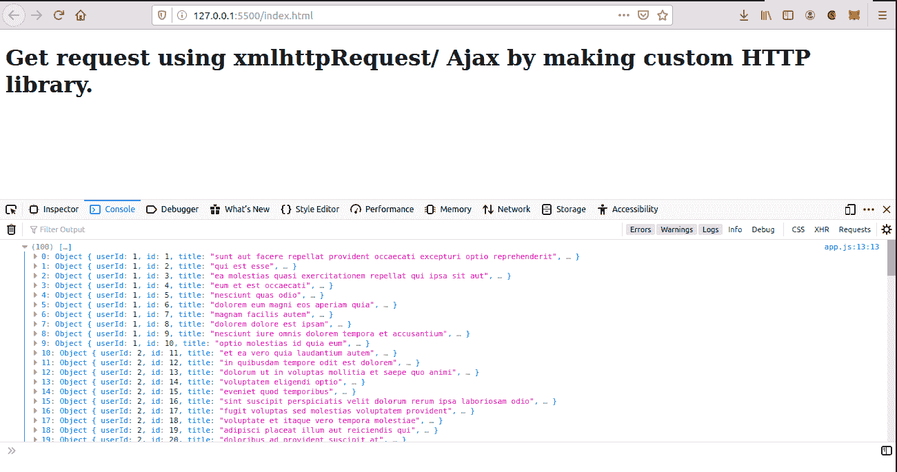

# 通过定制 HTTP 库

使用 AJAX 获取请求

> 原文:[https://www . geesforgeks . org/get-request-use-Ajax-by-making-custom-http-library/](https://www.geeksforgeeks.org/get-request-using-ajax-by-making-custom-http-library/)

任务是展示如何使用 **XMLHttpRequest** 通过定制 HTTP 库从应用编程接口获取数据。我将以一个包含对象数组的假应用编程接口为例，我们将展示如何通过定制的 HTTP 库通过 **XMLHttpRequest** 方法获取数据。

**API 链接:**[https://jsonplaceholder.typicode.com/posts](https://jsonplaceholder.typicode.com/posts)

**什么是 Ajax？**

使用 Ajax 或异步 JavaScript 和 XML 与服务器通信，无需刷新网页，从而增加用户体验和更好的性能。要了解更多关于 Ajax 的信息，请点击[https://www.geeksforgeeks.org/ajax-introduction/](https://www.geeksforgeeks.org/ajax-introduction/)。

**先决条件:**只需要 HTML、CSS、JavaScript 的基础知识。

**注意:**首先制作一个 HTML 文件，根据需要添加 HTML 标记。在正文的底部，附上了两个同样顺序的脚本文件，即“library.js”和“app.js”。

**方法:**制作“library.js”文件所需的步骤如下。

1.  在 **library.js** 文件中，制作一个函数 **easyHTTP** 来初始化一个**新的 XMLHttpRequest()** 方法。
2.  将 **easyHTTP.prototype.get** 设置为包含两个参数**【网址】**和一个**回调的函数。**
3.  现在使用**打开**功能启动一个对象。它需要三个参数，第一个是类型(GET 或 POST 或 PUT 或 DELETE)，第二个是 API 的 URL，最后一个是布尔值(“true”表示异步调用，“false”表示同步调用)。
4.  现在我们使用 **onload** 功能显示数据。 **onload** 函数在完成 API 调用后执行。我们将检查成功状态。如果状态代码是 200，那么我们将运行一个回调函数，它本身包含两个参数错误和响应文本。如果状态代码不是 200，回调函数将简单地打印错误消息。
5.  最后一步是使用 **send()** 功能发送请求。

**创建 **app.js** 文件**所需的步骤

1.  首先用新关键字实例化 **easyHTTP** 。
2.  在**中传递 URL 和一个回调函数，得到**原型函数。
3.  回调函数包含两个参数**错误**打印发生的错误和**响应**，获得实际响应。

    **执行上述步骤:**
    **HTML 文件:**

    ## 超文本标记语言

    ```
    <!DOCTYPE html>
    <html lang="en">

    <head>
        <meta charset="UTF-8">
        <meta name="viewport" content=
            "width=device-width, initial-scale=1.0">

        <title>Get request</title>
    </head>

    <body>
        <h1>
            Get request using xmlhttpRequest/ 
            Ajax by making custom HTTP library.
        </h1>

        <!-- Including library.js and app.js files -->
        <script src="library.js"></script>
        <script src="app.js"></script>
    </body>

    </html>
    ```

    **library.js:**

    ## java 描述语言

    ```
    function easyHTTP() {

        // Initialising new XMLHttpRequest method
        this.http = new XMLHttpRequest();
    }

    // Make an HTTP GET Request
    easyHTTP.prototype.get = function (url, callback) {

        // Open an obejct (GET/POST, PATH, 
        // ASYN-TRUE/FALSE) 
        this.http.open('GET', url, true);

        // Assigning this to self to have  
        // scope of this into the function
        let self = this;

        // When response is ready 
        this.http.onload = function () {

            // Checking status
            if (self.http.status === 200) {

                // Callback function (Error, response text)
                callback(null, self.http.responseText);
            } else {

                // Callback function (Error message)
                callback('Error: ' + self.http.status);
            }
        }

        // At last send the request 
        this.http.send();
    }
    ```

    **app.js**

    ## java 描述语言

    ```
    // Instantiating easyHTTP
    const http = new easyHTTP;

    // Get prototype method(URL, callback(error,
    // response text))
    http.get('https://jsonplaceholder.typicode.com/posts',
        function (err, posts) {
            if (err) {
                console.log(err);
            } else {

                // parsing string data to object
                let data = JSON.parse(posts);
                console.log(data);
            }
        });
    ```

    **输出:**
    