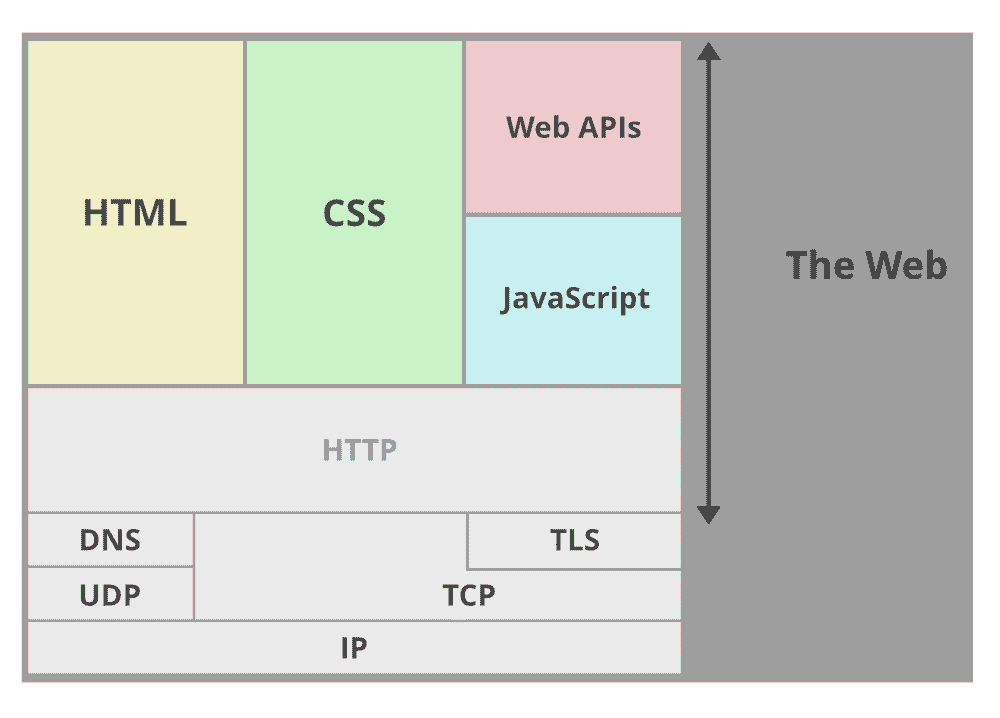
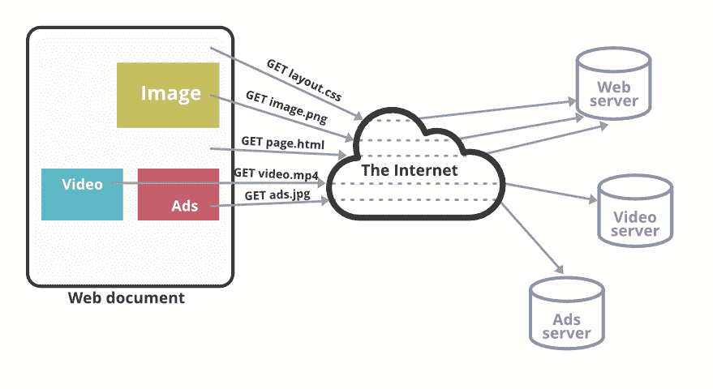
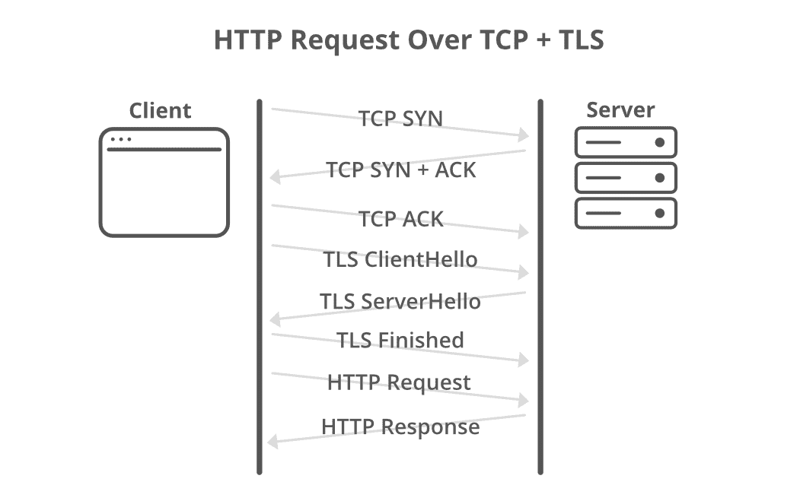
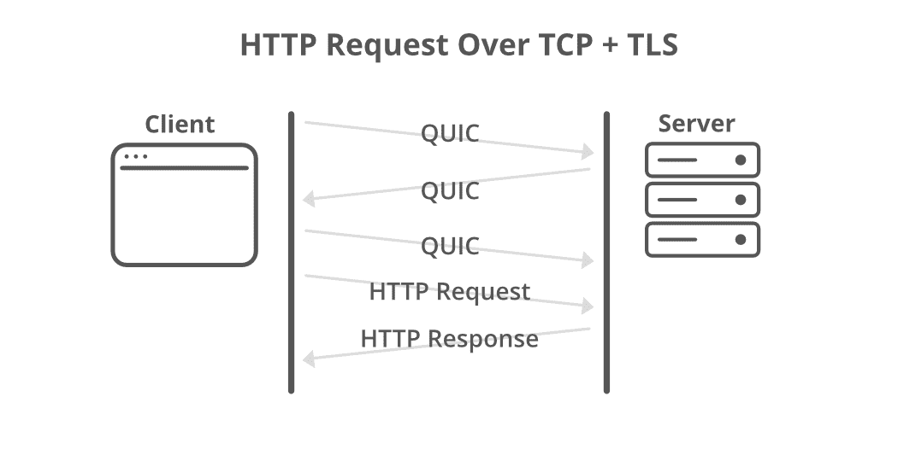

# 多年来 HTTP 是如何演变的？

> 原文:[https://www . geesforgeks . org/how-http-常年进化/](https://www.geeksforgeeks.org/how-http-evolved-throughout-the-years/)

HTTP……**网络的协议。**

如果你是一个对计算机科学感兴趣的人，那么你可能会意识到这个四个字的重要性。每次在除 ***之外的任何一种网站的 URL 开头看到这个词，你有没有*** ***试图去了解它是如何工作的，以及这些年来它是如何演变的……？你有没有尝试过获取更多关于 HTTP 的知识？***

今天在这个博客中，我们将讨论一些关于 HTTP 的概念，以及它在网络世界中如何在客户机和服务器之间发挥重要作用。

### **HTTP 入门？**

HTTP 代表**超文本传输协议**，基本负责 web 服务器和客户端之间的通信。它被定义为网络协议，或者我们可以说它是用于将网页从服务器传送到客户端的**规则集**。

每次你打开浏览器，访问一个网页，或者提交一个表单，或者点击一个发送某种 Ajax 请求或获取请求的按钮，你都在使用 HTTP，你会经历一些请求和响应周期。

HTTP 是**无状态**，每个请求都是完全独立的。每个请求都是一个单独的事务，当你发出一个请求，访问一个网页，或者你转到另一个页面，或者重新加载页面时，它不会记住任何关于前一个事务的信息。编程、本地存储、Cookies、会话用于创建增强的用户体验。

一般来说，你会在你的网络浏览器中看到 [HTTPS](https://www.geeksforgeeks.org/https-full-form/) (超文本传输协议安全)，这是为了更安全的目的与加密层一起使用的相同协议。数据由 **SSL(安全套接字层)/TLS(传输层安全性)**加密。所以任何时候如果你发送敏感信息，你都应该在 HTTPS 上空。

如果您了解网际网络/通信的 OSI(开放系统互连)规范，那么请将 HTTP 视为**应用层** **协议**。这一层与底层硬件结构或介质没有互连，也与此无关。由于这个原因，用更大的带宽来改进和升级 HTTP 规范是可行的。

让我们看看 Mozilla 是如何定义 HTTP 的…

> *“HTTP 是一种客户端-服务器协议:请求由一个实体发送，即用户代理(或代表它的代理)。大多数时候，用户代理是一个网络浏览器，但它可以是任何东西，例如*、*一个爬上网络来填充和维护搜索引擎索引的机器人。”*
> ***-Mozilla***

在上面的定义中，用户代理是客户端，该客户端可以是浏览器、程序或使用 HTTP 协议向服务器发送请求的任何东西。一旦服务器收到请求，它就会用网页的传递来响应。服务器和用户代理之间的通信由许多称为代理的实体协调。下面是代理的功能…

*   贮藏
*   过滤(隐藏成人内容并根据区域阻止一些内容)
*   负载平衡(将请求直接发送到空闲服务器)
*   身份验证(允许用户与不同的服务器通信)
*   日志记录(HTTP 日志记录常见于异常检测等)

在 HTTP 1 和 HTTP 1.1 中，上述所有任务都可以顺利执行。下面给出了一些常见的 HTTP 方法…

*   **获取:**从服务器检索数据
*   **开机自检:**向服务器提交数据
*   **PUT:** 更新服务器上已有的数据。
*   **删除:**从服务器中删除数据

### **HTTP 2**

HTTP 2 于 2015 年推出。随着网络技术和带宽的进步，HTTP 1 有一些局限性。HTTP 2 的出现克服了这些限制。HTTP 2 使您的应用程序更快、更简单、更安全、更高效。对版本 2 的所有更改几乎都是在幕后进行的，这意味着您不必去改变应用程序的工作方式。所有的核心概念、方法、URIs、状态代码都和 HTTP 1 一样。

*   HTTP 2 最大的优势是它**通过启用完全请求和响应复用来减少延迟**。多路复用通过相同的 TCP 连接支持并发请求，并有助于并发加载资源。
*   为了提高页面的速度和更快地加载内容，HTTP 2 允许浏览器对内容进行优先排序。
*   通过高效压缩 HTTP 头字段来最小化协议开销。
*   **服务器推送:**服务器在客户端明确请求每个资源之前，向客户端发送资源的能力。如果您曾经通过数据 URI 内联过 CSS、JavaScript 或任何其他资产，您可能会使用服务器推送。推送资源可以是:
    *   由客户端缓存。
    *   跨不同页面重复使用。
    *   与其他资源一起复用。
    *   由服务器确定优先级。
    *   被客户拒绝。

### **HTTP 3**

HTTP 3 是 HTTP 即将推出的版本。YouTube 已经在 chrome 浏览器中使用了这个版本。您可以使用插件查看 HTTP 协议(HTTP/2 和 SPDY 指示器)。HTTP3 使用与 HTTP 1 和 HTTP 2 相同的语义和响应代码。HTTP 2 的主要问题是[线路阻塞头](https://en.wikipedia.org/wiki/Head-of-line_blocking)，这是由对 TCP 的依赖引起的。HTTP 3 提供了更好的安全性和性能。

#### HTTP 3 有什么新功能？

HTTP 3 要简单得多，因为很多功能都被移到了[**【QUIC】**](https://en.wikipedia.org/wiki/QUIC)层。HTTP 3 的主要动机之一是简化 TCP 握手(它是一个 3 次握手，hi，hi 再次，ok 你得到了我的 hi，一样。).HTTP 2 也可以在 QUIC 上运行，但是 QUIC 不像 TCP 那样保证请求的顺序。HTTP 头压缩(HPACK)更多地依赖于 TCP 中的排序。由于这个原因，HTTP-2 在 QUIC 之上不可用。

[QUIC](https://en.wikipedia.org/wiki/QUIC) 协议用于更快地建立连接。这种建立的连接提供了在 Wifi 连接和移动网络等之间产生的更好的连接迁移。请记住，这种连接迁移不是您在同一网络中的路由器之间看到的。它更加复杂和精密。

QUIC 通过 **TCP 慢速启动**将拥塞窗口设置为初始值来启动每个连接。它升级了 TCP 慢速启动，以实现更快的高速。在此过程中，QUIC 进一步增加拥塞窗口，增加处理每个确认时确认的字节数。这导致拥塞窗口呈指数增长。

对于像 UHD 的体育场和视频流等情况下的游戏来说，这是一个重要的升级。这可能就是优图超快的背后原因，从启动就播放高清，没有缓冲。