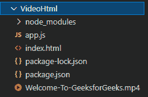
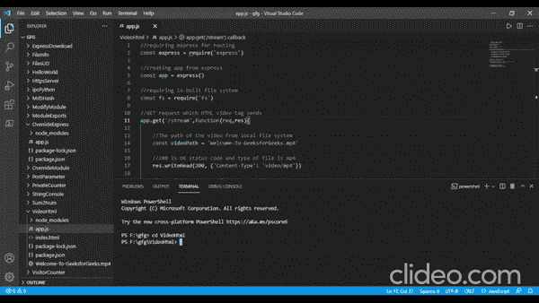

# 如何创建一个简单的 http 服务器在 3000 端口监听服务视频？

> 原文:[https://www . geesforgeks . org/如何创建一个简单的 http-server-在端口监听-3000-to-serve-video/](https://www.geeksforgeeks.org/how-to-create-a-simple-http-server-listening-at-port-3000-to-serve-video/)

借助“ **express** ”和内置的 nodeJS 文件系统“ **fs** ”，我们可以使用 nodeJS 向浏览器/前端提供视频。在这里，我们将使用 HTML 视频标签来查看网页上的视频。我们会使用快递作为路线。我们将通过创建一个读取流并将 res 对象传送到它来发送视频字节。让我们一步步走过去。

**步骤 1:** 创建一个“ **app.js** 文件，用 npm 初始化项目。此外，将您想要传输的视频文件保存在同一文件夹中。

```
npm init
```

**第二步:**现在安装 express，创建“**index.html**文件。

```
npm install express
```

**项目结构:**如下图。



项目结构

这里的**Welcome-To-GeeksforGeeks.mp4**就是我们要流的 mp4 文件。

**第三步:**我们现在对 **app.js** 文件进行编码。对“**/流**”的 GET 请求将视频作为可读流发送。应用程序的根目录加载“index.html”文件。我们使用 res.writeHead()函数发送状态消息为 200，表示 OK，内容类型为 mp4/video。我们现在将使用 fs.createReadStream()函数创建一个读取流，将视频作为 HTML 视频标签的可读流发送。

## app.js

```
// Requiring express for routing
const express = require('express')

// Creating app from express
const app = express()

// Requiring in-built file system
const fs = require('fs')

// GET request which HTML video tag sends
app.get('/stream',function(req,res){

    // The path of the video from local file system
    const videoPath = 'Welcome-To-GeeksforGeeks.mp4'

    // 200 is OK status code and type of file is mp4
    res.writeHead(200, {'Content-Type': 'video/mp4'})

    // Creating readStream for th HTML video tag
    fs.createReadStream(videoPath).pipe(res)
})

// GET request to the root of the app
app.get('/',function(req,res){

    // Sending index.html file for GET request
    // to the root of the app
    res.sendFile(__dirname+'/index.html')
})

// Creating server at port 3000
app.listen(3000,function(req,res){
    console.log('Server started at 3000')
})
```

**第四步:**现在我们将对“**index.html**文件进行编码。这里我们使用**控件**属性来提供视频标签中媒体播放器的各种控件。而**自动播放**是一个布尔属性，通过这个属性，视频可以在不停止加载数据的情况下，尽快自动开始播放。HTML 视频标签的 **src** 属性是 app.js 文件中定义的“/stream”。

## index.html

```
<!DOCTYPE html>
<html lang="en">

<head>
    <meta charset="UTF-8" />
    <meta http-equiv="X-UA-Compatible"
        content="IE=edge" />
    <meta name="viewport" content=
        "width=device-width, initial-scale=1.0" />
    <title>Video Stream</title>
</head>

<body>
    <!--  autoplay: A Boolean attribute; if 
        specified, the video automatically 
        begins to play back as soon as it can 
        do so without stopping to finish 
        loading the data -->

    <video controls autoplay width="500px" height="500px">

        <!-- GET request to the stream route -->
        <source src="/stream" type="video/mp4" />
    </video>
</body>

</html>
```

**步骤 5:** 现在使用运行应用程序

```
node app.js
```

**输出:**前往浏览器，输入 http://localhost:3000/



输出