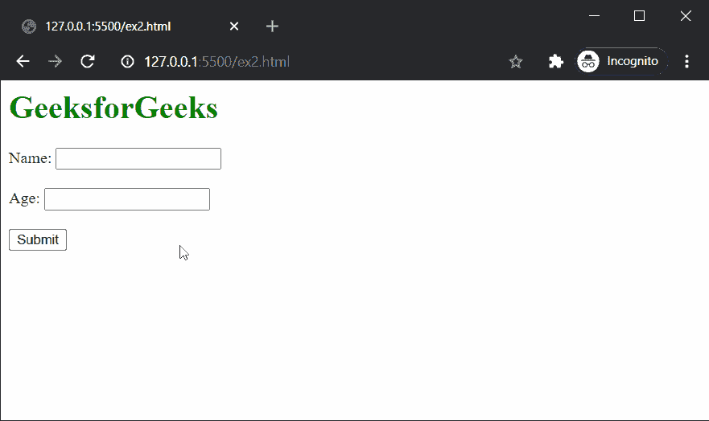
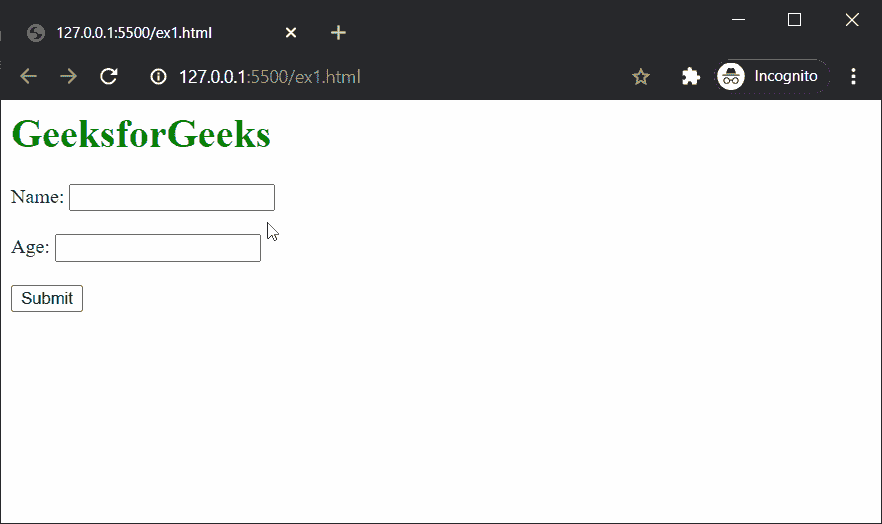

# 如何在 HTML5 中定义向动作 URL 发送数据的 HTTP 方法？

> 原文:[https://www . geesforgeks . org/如何定义将数据发送到动作 url 的 http 方法 html5/](https://www.geeksforgeeks.org/how-to-define-the-http-method-for-sending-data-to-the-action-url-in-html5/)

在本文中，我们将学习如何定义一个 HTTP 方法来将数据发送到动作 URL。**方法**属性用于指示如何将表单数据发送到**操作**网址中的给定服务器。根据需要，表单数据可以使用 GET 或 POST 方法发送。

GET 和 POST 方法之间的区别定义如下:

**1。获取方法**

*   表单数据在 URL 中以名称/值对的形式发送。
*   网址长度限制在 3000 个字符左右。
*   像密码这样的敏感信息不应该使用 GET 方法发送，因为它在请求的 URL 中是可见的。

**2。开机自检方法**

*   表单数据被追加到 HTTP 请求正文中。
*   因此，对数据的大小没有限制。
*   敏感数据可以使用此方法发送，因为它在请求的 URL 中不可见。

**语法:**

```html
<form method="get|post">
```

以下示例演示了使用可用方法发送数据:

**示例 1:** 使用GET 方法。

## 超文本标记语言

```html
<html>
<body>
<h1 style="color: green;">
  GeeksforGeeks
</h1>
<form action="form.php" method="get"
      target="_blank">
  <label for="name">Name:</label>
  <input type="text" id="name" name="name">
  <br><br>
  <label for="age">Age:</label>
  <input type="number" id="age" name="age">
  <br><br>
  <input type="submit" value="Submit">
</form>
</body>
</html>
```

**输出:**



**示例 2:** 使用开机自检方法。

## 超文本标记语言

```html
<html>
<body>
<h1 style="color: green;">
  GeeksforGeeks
</h1>
<form action="form.php" method="post"
      target="_blank">
  <label for="name">Name:</label>
  <input type="text" id="name" name="name">
  <br><br>
  <label for="age">Age:</label>
  <input type="number" id="age" name="age">
  <br><br>
  <input type="submit" value="Submit">
</form>
</body>
</html>
```

**输出:**

