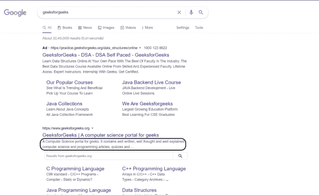
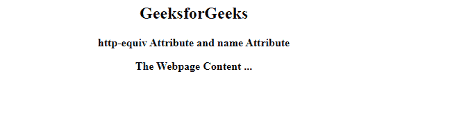

# 如何在 HTML5 中给出与 http-equiv 或 name 属性关联的值？

> 原文:[https://www . geesforgeks . org/如何给出与 http-equiv-or-name-attribute-in-html 5/](https://www.geeksforgeeks.org/how-to-give-the-value-associated-with-the-http-equiv-or-name-attribute-in-html5/)关联的值

[**http-equiv**](https://www.geeksforgeeks.org/html-http-equiv-attribute/) 和 [**名称**](https://www.geeksforgeeks.org/html-meta-name-attribute/) 属性在 HTML 程序中的 [**meta**](https://www.geeksforgeeks.org/html-meta-tag/) 标记中指定。*元*标签包含在 HTML 文档的头部。它用于定义关于 HTML 文档的元数据(描述数据的数据)。

*meta、*下有很多不同的元素，但我们将讨论 *http-equiv* 和*名称*属性。

**定义:**

1.  **http-equiv :** 设置 http 响应消息头的信息(例如内容)。它需要一些值，如*内容安全策略、内容类型、默认样式、*和*刷新。*
2.  **名称:**指定元数据的类型/名称。它还有一堆我们可以用作输入的值，如*应用程序名称、作者、描述、生成器、关键字、*和*视口。*

当你在谷歌“ *geeksforgeeks* ”上搜索时，你会注意到一个描述。它是通过使用*名称*属性和使用*内容*属性来实现的，这些属性具有要为描述显示的相应值。

**语法:**

```htmlhtml
 <meta name="description" 
content="It contains the description for your web application">
```



谷歌搜索极客博客

**HTML 代码:**HTML 程序同时使用了这两个属性。添加注释是为了让您以更好的方式理解。

## 超文本标记语言

```htmlhtml
<html lang="en">

<!--head tag starts-->
<head>

    <meta name="application-name" 
          content="Write the name of the web application">
    <meta name="author" 
          content="Write the name of the author here">
    <meta name="description" 
          content="It contains the description for your web application">
    <meta name="generator" 
          content="Enter the generating software which is used as per 
                   it's corresponding content(like WordPress 3.0, etc)">
    <meta name="keywords" 
          content="keyword1, keyword2, keyword3, keyword4">
    <meta name="viewport" 
          content="width=device-width, initial-scale=1.0">

    <!--content-security-policy is used for specifying the content policy-->
    <meta http-equiv="content-security-policy" 
          content="default-src 'self' *.example.com">

    <!--content-type is used to specify the encoding, 
        we have used UTF-8 which is used to represent
        any character in Unicode Standard-->
    <meta name="content-type" 
          content="text/html" 
          charset="UTF-8">

    <!--default-style is used to specify the preferred stylesheet-->
    <meta http-equiv="default-style" 
          content="The preferred stylesheet which is used">

    <!--http-equiv gets the document content refreshed in every 9 seconds-->
    <meta http-equiv="refresh" 
          content="9"> 
    <title>GFG</title>

</head>
<!--head tag ends-->

<!--body tag starts -->
<body>

    <center>
        <h2 style="color:green">GeeksforGeeks</h2>
        <b>http-equiv Attribute and name Attribute</b><br/>
        <p></p><p></p>
        <div>
          <b> The Webpage Content ...</b>
        </div>
    </center>

</body>
<!--body tag ends here-->
</html>
```

**输出:**



示例网页