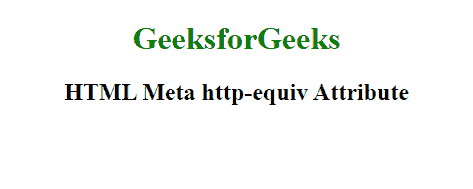

# HTML |  http-equiv 属性

> 原文:[https://www . geesforgeks . org/html-meta-http-equiv-attribute/](https://www.geeksforgeeks.org/html-meta-http-equiv-attribute/)

**HTML <元> http-equiv 属性**用于提供内容属性的头信息或值。它可以用来模拟一个 HTTP 头响应。
可用于元元素。
**语法:**

```html
<meta http-equiv="content-type | default-style | refresh">
```

**例:**

## 超文本标记语言

```html
<!DOCTYPE html>
<html>

<head>
    <title>
    HTML Meta http-equiv Attribute
    </title>
    <meta name="keywords about"
        content="Meta Tags, Metadata" />

    <meta name="description"
        content="Learning about Meta Tags." />

    <meta name="revised about"
        content="GeeksforGeeks" />

    <meta http-equiv="refresh"
        content="8" />
</head>

<body>
    <center>
        <h1 style="color:green">
        GeeksforGeeks
    </h1>
        <h2>
        HTML Meta http-equiv Attribute
    </h2>
    </center>
</body>

</html>                      
```

**输出:**



**支持的浏览器:**HTML Meta http-equiv 属性支持的浏览器如下:

*   谷歌 Chrome
*   微软公司出品的 web 浏览器
*   火狐浏览器
*   歌剧
*   旅行队