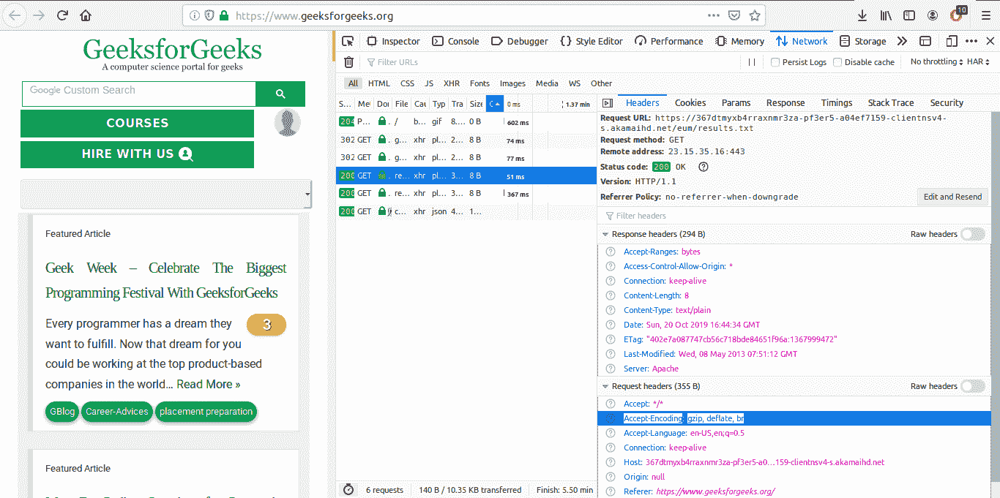

# HTTP 头|接受编码

> 原文:[https://www.geeksforgeeks.org/http-headers-accept-encoding/](https://www.geeksforgeeks.org/http-headers-accept-encoding/)

**HTTP 头接受-编码**通常是请求头的比较算法。所有的 HTTP 客户端都用来告诉服务器它支持哪种编码。然后服务器将以任何支持的编码格式进行响应。服务器选择提议中的任何一个，使用它并用**内容编码**响应头通知客户端它的选择。

**语法:**

```
Accept-Encoding: gzip | compress | deflate | br| identity| *
```

**注意:**多个算法也是可以适用的。

**指令:**

*   **gzip:** 这是一种使用莱姆佩尔-齐夫编码(LZ77)的压缩格式，带有 32 位循环冗余校验。
*   **压缩:**这是一种使用伦佩尔-齐夫-韦尔奇(LZW)算法的压缩格式。
*   **deflate:** 这是一种使用 zlib 结构的压缩格式，带有 deflate 压缩算法。
*   **br:** 这是一种使用 Brotli 算法的压缩格式。
*   **标识:**该指令指示始终可接受的标识功能。
*   ***:** 该指令匹配任何可在标题中列出或不列出的内容编码。这是默认值。

你可以查看你的**接受编码**和**内容编码**在这个[网站](https://gtmetrix.com/)上的表现有多好。
**例:**

```
Accept-Encoding: gzip, deflate, br
```

```
Accept-Encoding: br;q=1.0, gzip;q=0.6, *;q=0.1
```

要检查此接受编码是否有效，请转到**检查元素** - > **网络**检查接受编码的请求头，如下所示，接受编码高亮显示，您可以看到。


**支持的浏览器:**与 **HTTP 头接受编码**兼容的浏览器如下:

*   谷歌 Chrome
*   微软公司出品的 web 浏览器
*   火狐浏览器
*   旅行队
*   歌剧