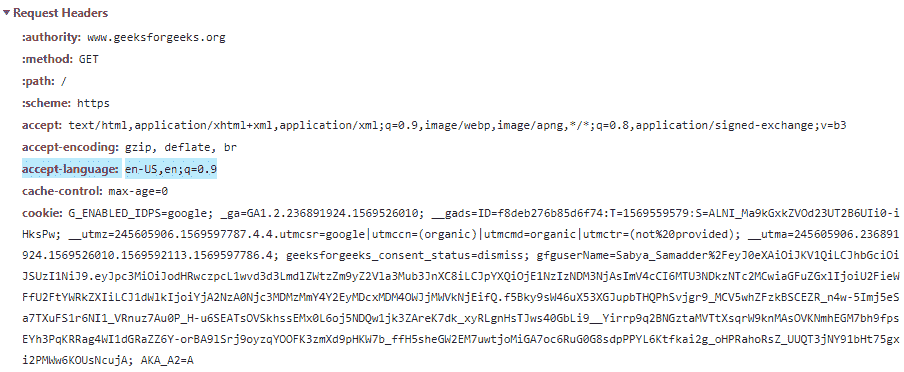

# HTTP 头|接受-语言

> 原文:[https://www.geeksforgeeks.org/http-headers-accept-language/](https://www.geeksforgeeks.org/http-headers-accept-language/)

这个 **HTTP Accept-Language 头**告诉服务器客户端可以理解的所有语言。在内容协商的帮助下，在 HTTP Accept-Language 建议中将有一组支持的语言，然后服务器选择这些语言的建议之一，并将其放在[内容语言](https://www.geeksforgeeks.org/http-headers-content-language/)标题中。在少数情况下，用户可以手动更改语言，否则服务器会通过浏览器的语言来检测支持的语言。但是请记住一点，建议服务器永远不要覆盖明确的决定。如果用户对服务器语言中未列出的语言感到满意，则服务器不能向客户端提供匹配的语言，在这种情况下 **406 不可接受状态代码**将被发送。

**语法:**

*   这是特定的语言选择语法。

    ```
    Accept-Language: <language>
    ```

*   这种语法可以作为通配符(选择所有语言)。

    ```
    Accept-Language: *
    ```

**注意:**使用逗号和可选的可以列出多种语言。
**指令:**此标题接受两个指令，如上所述，如下所述:

*   **<语言> :** 这由代表该语言的 2-3 个字母的基本语言标签组成，后面是用“-”分隔的子标签。额外的信息是地区和国家变量(如“美国”或“加拿大”)
*   ***:** 它用作任何语言的通配符。

**注:**本**；q=** 它定义了因子权重，该值按照使用相对质量值
**表示的偏好顺序排列。示例:**

*   在本例中，单个值位于美国英语的接受语言标题上。

    ```
    accept-language: en-US
    ```

    *   在本例中，双精度值位于接受语言标题上，即美国的英语和加拿大的法语。

    ```
    Accept-Language: en-US,fr-CA
    ```

    *   In this example single value is on Accept-Language header that is English of US with the factor weighting.

    ```
    accept-language: en-US,en;q=0.9
    ```

    要检查此接受语言是否有效，请转到**检查元素- >网络**检查接受语言的请求头，如下所示，接受语言突出显示，您可以看到。
    
    **支持的浏览器:**浏览器兼容 **HTTP 接受语言头**如下:

    *   谷歌 Chrome
    *   微软公司出品的 web 浏览器
    *   火狐浏览器
    *   旅行队
    *   歌剧