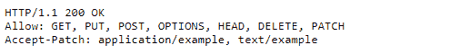

# HTTP 头|接受-补丁

> 原文:[https://www.geeksforgeeks.org/http-headers-accept-patch/](https://www.geeksforgeeks.org/http-headers-accept-patch/)

**补丁**用于对现有资源进行部分更改。**接受-补丁 HTTP 头**是一个响应 HTTP 头，指定是否支持补丁文档，以及服务器能够理解的媒体类型。此标题中存在特定的修补程序文档格式表明资源上允许特定的格式。415 如果媒体不受支持，将回复“不支持的媒体类型”。所以基本上这个头指定这个服务器支持的补丁文档格式是主要工作。

**语法:**

```
Accept-Patch: media types
```

**指令:**Accept-Patch 没有指令，只需要为服务器指定支持的格式即可。

**示例:**

*   该示例显示了一个支持补丁的服务器，通常使用两种基于补丁的文档格式

    ```
    Accept-Patch: application/example, text/example
    ```

*   此示例显示了一个服务器，其支持的格式设置为 HTTP-charset 参数。

    ```
    Accept-Patch: text/example;charset=utf-8
    ```

要检查此接受补丁的运行情况，请转到**检查元素- >网络**检查接受补丁的响应头，如下所示。

**支持的浏览器:**兼容 **HTTP Accept-Patch** 头文件的浏览器如下:

*   谷歌 Chrome
*   微软公司出品的 web 浏览器
*   火狐浏览器
*   歌剧
*   旅行队