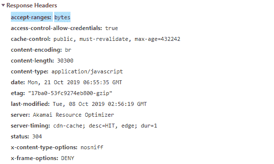

# HTTP 头|接受范围

> 原文:[https://www.geeksforgeeks.org/http-headers-accept-ranges/](https://www.geeksforgeeks.org/http-headers-accept-ranges/)

**HTTP 接受范围**是响应类型头，也是范围系统的一部分。这个头充当服务器用来支持客户端部分请求的标记。当客户端请求一个巨大文件的任何特定部分时，HTTP Accept-Ranges 是有用的，然后这个头将响应并允许客户端下载那个巨大文件的特定部分。例如，如果您的服务器包含一个 10M 的文件，而客户端要求该文件的最后 100 个字节，那么它可以请求服务器只发送该范围内偏移量的数据。

**接受范围**适用于某些特定资源，不同的范围类型适用于另一种类型的资源。接受范围有一个好处，就是客户端可以请求任何字节范围，而无需检查服务器是否支持范围。当客户端作为响应请求该范围时，服务器发送状态码 206，如果它正在发送该文件的范围，则该状态码是部分内容，或者如果它正在发送整个文件，则发送状态码 200。

**语法:**

```html
Accept-Ranges: bytes | none
```

**指令:**该标题接受两个指令，如上所述，如下所述:

*   **字节:**该指令定义的范围单位是字节。您可以请求字节范围。
*   **无:**表示不支持范围单位。不应使用该指令。该指令将删除下载管理器中的暂停按钮。

**注意:**Internet Explorer 中使用了 None 指令。

**示例:**

```html
Accept-Ranges: bytes
```

要检查该接受范围是否有效，请转到检查**元素- >网络**检查接受范围的响应标题，如下所示，接受范围突出显示，您可以看到。

**支持的浏览器:**与**兼容的浏览器 HTTP 头接受范围**如下:

*   谷歌 Chrome
*   微软公司出品的 web 浏览器
*   火狐浏览器
*   旅行队
*   歌剧