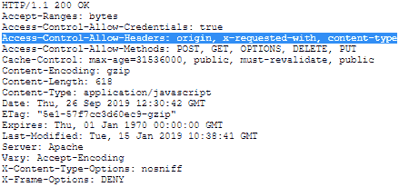

# HTTP 头|访问控制-允许-头。

> 原文:[https://www . geesforgeks . org/http-headers-access-control-allow-headers/](https://www.geeksforgeeks.org/http-headers-access-control-allow-headers/)

**HTTP 访问控制允许头**头是一个响应类型的头，用于指示 HTTP 头。它可以在请求期间使用，并用于响应 CORS 飞行前请求，检查 CORS 协议是否被理解，服务器是否知道使用特定的方法和报头，包括**访问控制请求报头 HTTP 报头**。

**语法:**

```
Access-Control-Allow-Headers: <header-name>
```

**注意:**可以使用多个表头。

**指令:**该标题接受下述两个指令:

*   **<头-名称> :** 指定支持的请求头。如果有多个标题在使用，我们用逗号将它们分开。
*   ***(通配符):**用于没有 HTTP cookies 或 HTTP 认证信息的请求。应该注意的是，授权头不能是通配符，需要明确提及。

**示例:**

*   当只有一个标题时

    ```
    Access-Control-Allow-Headers: Proxy-Authorization
    ```

    *   When there are multiple headers

    ```
    Access-Control-Allow-Headers: Proxy-Authorization, Max-Forwards
    ```

    要检查访问控制允许报头，请转到**检查元素- >网络**。检查如下图所示的响应标题:访问控制-允许-标题突出显示
    

    **支持的浏览器:**浏览器兼容 **HTTP 访问控制允许标题**标题如下:

    *   谷歌 Chrome 4.0
    *   Internet Explorer 12.0
    *   Firefox 3.5
    *   Opera 12.0
    *   Safari 4.0

    **注意:** *(通配符)指令可能在 Safari 和 Internet Explorer 上不受支持。