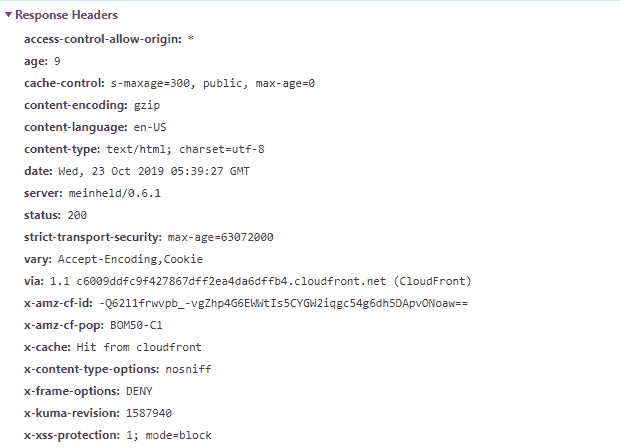

# HTTP 头|访问控制-允许-来源

> 原文:[https://www . geesforgeks . org/http-headers-access-control-allow-origin/](https://www.geeksforgeeks.org/http-headers-access-control-allow-origin/)

**访问控制允许源**是一个响应头，用于指示该响应是否可以与来自给定源的请求代码共享。

**语法:**

```
Access-Control-Allow-Origin: * | <origin> | null
```

**指令:**访问控制-允许-起源接受上面提到的和下面描述的指令类型:

*   ***:** 这个指令告诉浏览器允许来自任何来源的请求代码访问资源。用作通配符。
*   **<原点> :** 本指令定义任何单一原点。
*   **null:** 该指令定义了 null，由于任何来源都可能创建一个“null”Origin 的敌对文档，因此不应使用该 null。因此，应避免使用 **ACAO(访问控制-允许-来源)**标题的“空”值。"

**示例:**

*   这个例子告诉浏览器允许任何来源的代码访问资源。

    ```
    access-control-allow-origin: *
    ```

*   A response that tells the browser to allow requesting code from the origin https://www.geeksforgeeks.org to access a resource will include the following:

    ```
    access-control-allow-origin:*https://www.geeksforgeeks.org*
    ```

    这里，将源请求头的值与允许的源列表进行比较，如果响应头源值存在于该比较列表中。然后将**访问控制允许原点**值设置为与原点值相同的值。

要检查此访问控制-允许-起源的操作，请转到检查**元素- >网络**检查访问控制-允许-起源的响应头如下所示，访问控制-允许-起源高亮显示，您可以看到。

**支持的浏览器:**兼容 **HTTP 头的浏览器访问控制允许来源**如下:

*   谷歌 Chrome 4.0
*   Internet Explorer 10.0
*   Firefox 3.5
*   Safari 4.0
*   Opera 12.0