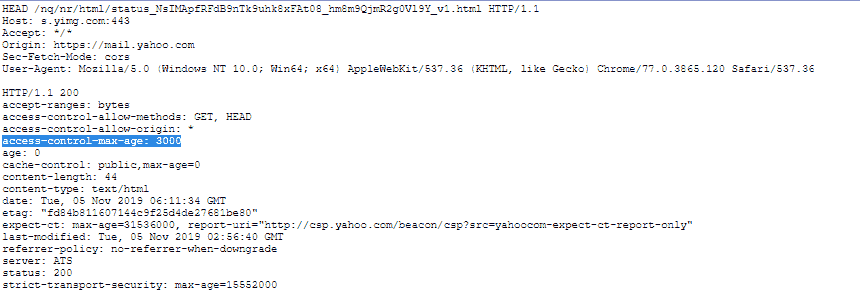

# HTTP 头|访问控制-最大年龄

> 原文:[https://www . geesforgeks . org/http-headers-access-control-max-age/](https://www.geeksforgeeks.org/http-headers-access-control-max-age/)

**访问控制最大年龄** HTTP 头是一个响应头，它给出了可以缓存 CORS 飞行前请求结果的时间，该请求检查 CORS 协议是否被理解，以及服务器是否知道使用特定的方法和头。CORS 飞行前请求包含在**访问控制允许方法**和**访问控制允许标题**标题中。

**语法:**

```html
Access-Control-Max-Age: <delta-seconds>
```

**指令:**该标题接受上面提到的和下面描述的单个指令:

*   **<delta-秒> :** 它指定结果最多可以缓存多少秒。

**注意:**如果存在-1，则禁用缓存。

**示例:**

*   在本例中，预检请求的结果会被缓存 200 秒。

    ```html
    Access-Control-Max-Age: 200
    ```

*   在本例中，不允许缓存结果。

    ```html
    Access-Control-Max-Age: -1
    ```

要检查此访问控制最大年龄是否有效，请转到**检查元素- >网络**检查访问控制最大年龄的响应头如下所示，访问控制最大年龄高亮显示，您可以看到。
[](https://media.geeksforgeeks.org/wp-content/uploads/20191105120026/access-control-max-age.png)

**支持的浏览器:**浏览器兼容 **HTTP 访问控制最大年龄标题**如下:

*   谷歌 Chrome 4.0
*   Internet Explorer 10.0
*   Opera 12.0
*   Firefox 3.5
*   Safari 4.0