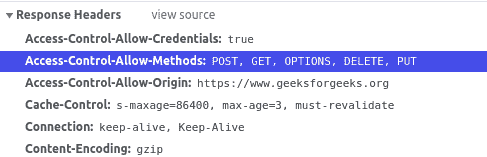

# HTTP 头|访问控制请求方法

> 原文:[https://www . geesforgeks . org/http-headers-access-control-request-method/](https://www.geeksforgeeks.org/http-headers-access-control-request-method/)

**HTTP 头访问-控制-请求-方法**是一个请求类型头，用于通知服务器在发出实际请求时将使用哪种 HTTP 方法。

**语法:**

```
Access-Control-Request-Method: <method>
```

**指令:**该标题接受上面提到的和下面描述的单个指令:

*   **<方法> :** 该指令包含实际请求时将使用的方法。

**注意:**实际会提出请求时，可以使用多种方法。

**示例:**

*   ```
    Access-Control-Request-Method: POST
    ```

*   ```
    Access-Control-Request-Method: GET, PUT
    ```

要检查此**访问控制请求方法**是否正在运行，请转到**检查元素- >网络**检查请求头中的**访问控制请求方法**如下所示，**访问控制请求方法**高亮显示，您可以看到。


**支持的浏览器:**兼容 **HTTP 头访问控制请求方法**的浏览器如下:

*   谷歌 Chrome
*   微软公司出品的 web 浏览器
*   火狐浏览器
*   旅行队
*   歌剧