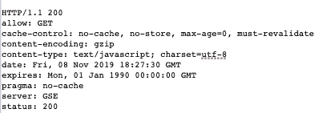

# HTTP 头|允许

> 原文:[https://www.geeksforgeeks.org/http-headers-allow/](https://www.geeksforgeeks.org/http-headers-allow/)

**HTTP Allow** 头是一个实体类型的头，它指定了资源支持的有效方法。用于响应不允许的 **405 方法**。如果这个头是空的，这意味着资源不允许任何请求方法。

**语法:**

```html
Allow: <http-methods>
```

**指令:**HTTP 允许头接受上面提到的和下面描述的单个指令:

*   **< http-methods > :** 这个指令保存了 http 请求方法的列表。如果请求不止一个，则请求用逗号分隔。

**示例:**

*   当只有一种方法时。POST 方法用于将实体提交给指定的资源，这通常会导致服务器上的状态发生变化。

    ```html
    Allow: POST
    ```

*   当有多种方法时。PATCH 方法用于在 DELETE 方法删除指定资源时对资源应用部分修改。

    ```html
    Allow: PATCH, DELETE
    ```

要检查此允许操作，请转到检查**元素- >网络**检查允许的标题，如下所示。



**支持的浏览器:**兼容 **HTTP 允许头**的浏览器如下:

*   谷歌 Chrome
*   微软公司出品的 web 浏览器
*   火狐浏览器
*   旅行队
*   歌剧