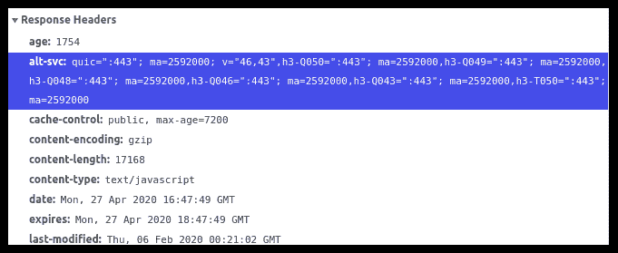

# HTTP 头| Alt-Svc

> 原文:[https://www.geeksforgeeks.org/http-headers-alt-svc/](https://www.geeksforgeeks.org/http-headers-alt-svc/)

**HTTP 头 Alt-Svc** 头是一个响应类型的头，它已被用于通告替代服务。哪些服务可以由协议/主机/端口组合来定义。

**语法:**

```html
Alt-Svc: clear
```

```html
Alt-Svc: <protocol-id>=<alt-authority>; ma=<max-age>; persist=1
```

**指令:**该标题接受五个指令，如上所述，如下所述:

*   **明确:**该指令规定，该产地的所有替代服务均无效。
*   **<协议-id > :** 该指令是 **ALPN** 协议的标识符。
*   **<替代权限> :** 该指令定义了一个替代权限，包括可选的主机覆盖、冒号和强制端口号。
*   **ma= <最大年龄> :** 它保存定义替代服务被视为新鲜的秒数。如果省略它，默认值将是 86400。这是一个可选指令。
*   **persist=1:** 该指令保存在网络配置更改时清除的替代服务。使用 persist=1 可以确保条目不会因为这样的更改而被删除。

**示例:**

*   ```html
    Alt-Svc: h2=":425"; ma=2585900; persist=1
    ```

*   ```html
    Alt-Svc: h2=":485"; ma=592000; 

    ```

要检查此 **Alt-Svc** 是否正在运行，请转到**检查元素- >网络**检查 **Alt-Svc** 的请求标题，如下图所示， **Alt-Svc** 高亮显示，您可以看到。



**支持的浏览器:**与 **HTTP 头 Alt-Svc** 兼容的浏览器如下:

*   谷歌 Chrome
*   微软公司出品的 web 浏览器
*   火狐浏览器
*   旅行队
*   歌剧