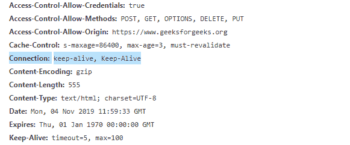

# HTTP 头|连接

> 原文:[https://www.geeksforgeeks.org/http-headers-connection/](https://www.geeksforgeeks.org/http-headers-connection/)

**HTTP 连接头**是一个通用类型头，允许发送方或客户端指定特定连接所需的选项。连接不是为每个请求/响应打开一个新的连接，而是使用一个 TCP 连接来发送或接收多个 HTTP 请求/响应。它还控制当前事务完成后网络是保持打开还是关闭。

**语法:**

```html
Connection: keep-alive
Connection: close
```

**指令:**这个 HTTP 连接头接受上面提到的和下面描述的两个指令:

*   **保持活动状态**该指令表示客户端在发送响应消息后希望保持连接打开或活动。在 HTTP 1.1 版本中，默认情况下使用持久连接，在该连接中，事务后不会自动关闭。但是 HTTP 1.0 不会认为连接是持久的，所以如果你想让它保持活动，你需要包含一个保持活动的连接头。
*   **关闭**该关闭连接指令表示客户端发送响应消息后想要关闭连接。在 HTTP 1.0 中，默认情况下，连接会关闭。但是在 HTTP 1.1 中，如果您希望连接关闭，您需要将其包含在标头中。

**注意:**这两个指令也是表示组合中连接的头。

**示例:**

*   这里，在下面的例子中，连接是保持活动的(即客户端希望保持它打开)，值是 100。通常，值 100 对于几乎所有场景都足够了。但是，您可以根据服务器需要在网页中传递的文件数量来增加它。

    ```html
    Keep-Alive: 100
    Connection: keep-alive
    ```

*   下面的例子是一个客户端发送的请求消息，它希望连接在响应消息发送后关闭。

    ```html
    Connection: close
    ```

要检查该连接的运行情况，请转到**检查元件- >网络**检查连接的标题，如下所示。
[](https://media.geeksforgeeks.org/wp-content/uploads/20191104173958/connection1.png)

**浏览器兼容性:**浏览器兼容 **HTTP 连接头**如下:

*   谷歌 Chrome*   微软公司出品的 web 浏览器*   边缘*   火狐浏览器*   旅行队*   歌剧