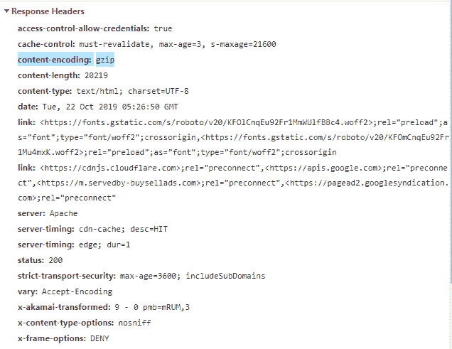

# HTTP 头|内容编码

> 原文:[https://www . geesforgeks . org/http-headers-content-encoding/](https://www.geeksforgeeks.org/http-headers-content-encoding/)

**HTTP 头内容编码**用于压缩媒体类型。它通知服务器用户将支持哪种编码。它将信息发送到接受编码。服务器选择提议中的任何一个，使用它并用**内容编码**响应头通知客户端它的选择。
**语法:**

```html
Content-Encoding: gzip | compress | deflate | br| identity

```

**注意:**也可以应用多种算法。

**指令:**

*   **gzip:** 它使用莱姆佩尔-齐夫编码(LZ77)，32 位 CRC 格式。它是 UNIX gzip 程序的原始格式。
*   **压缩:**采用莱姆佩尔-齐夫-韦尔奇(LZW)算法。由于专利问题，许多现代浏览器不支持这种类型的内容编码。
*   **deflate:** 该格式采用 zlib 结构，带有 deflate 压缩算法。
*   **br:** 这是一种使用 Brotli 算法的压缩格式。
*   **标识:**表示没有压缩。

你可以查看你的**接受编码**和内容编码在这个[网站上的表现。](https://gtmetrix.com)

**示例:**

*   单次压缩:

    ```html
    Content-Encoding: gzip
    Content-Encoding: compress

    ```

    *   Multiple Compression:

    ```html
    Content-Encoding: gzip, compress

    ```

    要检查**内容编码**是否正在运行，请转到检查**元素- >网络**检查**内容编码**的请求头，如下所示，**内容编码**高亮显示，您可以看到。
    
    **支持的浏览器:**与 **HTTP 头内容编码**兼容的浏览器如下:

    *   谷歌 Chrome
    *   微软公司出品的 web 浏览器
    *   火狐浏览器
    *   旅行队
    *   歌剧