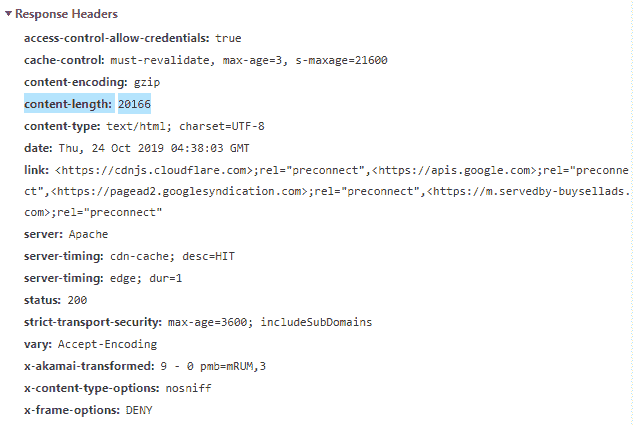

# HTTP 头|内容-长度

> 原文:[https://www.geeksforgeeks.org/http-headers-content-length/](https://www.geeksforgeeks.org/http-headers-content-length/)

**HTTP 头**用于在 HTTP 请求或 HTTP 响应中传递附加信息。 **HTTP Content-Length** 实体头用于以八进制数(即字节数)表示实体体的大小，并将其发送给收件人。这是一个禁止的标题名称。基本上是请求或响应正文中的数据字节数。正文在标题下面的空行之后。

**语法:**

```html
Content-Length: <length>
```

**指令:**该标题接受上面提到的和下面描述的单一指令:

*   **长度:**以十进制八位数或字节数定义实体体的长度。

**示例:**

```html
content-length: 6553
```

```html
content-length: 54138
```

要检查此内容长度是否有效，请转到**检查元素- >网络**检查内容长度的请求头，如下所示，内容长度突出显示。

**支持的浏览器:**与 **HTTP 头兼容的浏览器内容长度**如下:

*   谷歌 Chrome
*   微软公司出品的 web 浏览器
*   火狐浏览器
*   旅行队
*   歌剧