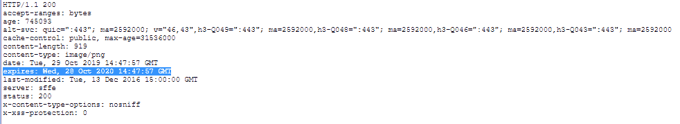

# HTTP 头|过期

> 原文:[https://www.geeksforgeeks.org/http-headers-expires/](https://www.geeksforgeeks.org/http-headers-expires/)

**HTTP Expires 头**是一个响应类型的头，是控制当前缓存的基本方式。expire 头包含日期和时间，表示对象可以保持活动的时间段。一旦期限到期，对象就会失效。几乎每个客户端都支持过期标头。如果缓存控制头带有最长期限指令，通常会忽略过期头。用户不需要按重新加载按钮就可以获得活动对象。一旦时间到期，缓存将控制页面。Web 服务器允许客户端以多种方式设置过期标头。最常见的两种方式可能包括:

*   **上次访问时间:**根据客户端访问对象的最终时间设置到期时间。
*   **最后修改时间:**表示文档在服务器上最后一次被修改的时间。

**语法:**

```
Expires: <http-date>
```

**指令:**HTTP Expires 头接受上面提到的和下面描述的单个指令:

*   **< http-date > :** 本指令包含退休的日期时间信息。

以下示例将说明 HTTP 过期标头:

**示例:**在本例中，对象设置有到期日期和时间。这将使缓存知道何时获取对象的新副本。用户不需要按重新加载按钮就可以获得活动对象。一旦时间到期，缓存将控制页面。

```
Expires: Mon,11 Nov 2019 08:36:00 GMT
```

要检查该过期操作，请转到**检查元素- >网络**检查过期的响应头，如下所示，过期被突出显示，您可以看到。

**注:**HTTP 日期中表示的时间应始终为格林威治标准时间(GMT)，而不是当地时间。

**支持的浏览器:**浏览器兼容 **HTTP 过期标题**如下:

*   谷歌 Chrome
*   微软公司出品的 web 浏览器
*   火狐浏览器
*   旅行队
*   歌剧