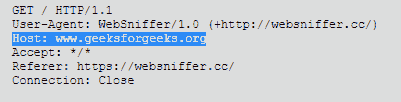

# HTTP 头|主机

> 原文:[https://www.geeksforgeeks.org/http-headers-host/](https://www.geeksforgeeks.org/http-headers-host/)

**HTTP 主机**代表服务器的**域名**。也可以表示服务器使用的**传输控制协议(TCP)** 端口号。定义端口号是可选的，会考虑默认值。例如，当没有指定端口号时，“80”被指定为 HTTP URL 的端口号。HTTP 主机头是一个请求类型头。所有 HTTP/1.1 请求消息中都必须发送主机头字段。如果请求消息没有任何报头字段或不止一个报头字段，则发送 400 错误请求。

**语法:**

```html
Host: <host>:<port>
```

**指令:**HTTP 头主机接受上面提到的和下面描述的两个指令:

*   **<主机> :** 本指令代表服务器的域名。*   **<port>:** This directive is an **optional** one. It represents the TCP port number in which the server is working.

    **注意:**你可以在此[链接查看任何一家网站主机。](https://websniffer.cc)
    **例:**

    *   GeeksforGeeks cdn 页面的主机。

        ```html
        Host: www.cdn.geeksforgeeks.org
        ```

    *   极客主机主页。

        ```html
        Host: www.geeksforgeeks.org
        ```

    

    **支持的浏览器:**与 **HTTP 主机头**兼容的浏览器如下:

    *   谷歌 Chrome
    *   微软公司出品的 web 浏览器
    *   边缘
    *   Mozilla Firefox
    *   歌剧
    *   旅行队