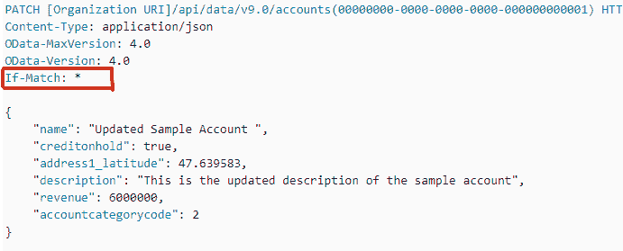

# HTTP 头|如果匹配

> 原文:[https://www.geeksforgeeks.org/http-headers-if-match/](https://www.geeksforgeeks.org/http-headers-if-match/)

**HTTP 头如果匹配**是请求类型头。它用于使请求有条件。如果它与列出的条件 ETags 之一相匹配，那么服务器将发回请求的 PUT 和其他非安全方法的资源，在这种情况下，它将只上传资源。

这个 **ETag** 头使用了字符串比较算法。使用这个标题是两个常见的用例:

*   它可以确保请求的现代范围来自与过去相同的资源。对于 **GET** 和 **HEAD** 方法，与 Run HEAD 结合使用，如果在某一点返回 416(范围不可满足)反应，则它不协调。
*   如果匹配可以用来预测放错地方的升级问题，对于其他方法，特别是对于 PUT。它可以检查客户端需要传输的资源的变更是否不会覆盖自获取第一个资源以来所做的另一个变更。如果没有请求响应，则返回 412(前提条件失败)响应。

**语法**

```
If-Match:<*;
If-Match:<etag_value>, <etag_value>, ...
```

**指令:**该标题接受两个指令，如上所述，如下所述:

*   **< etag_value >** 这个指令保存了 etag 列表的值，值是以字符串的形式放在双引号之间的 ASCII 字符。用前缀 W/表示它们“弱”。
*   ***:**

    星号指令可以是表示资源的特殊值。

**示例:**

```
If-Match: *
```

```
If-Match: "afyr456nfk560hfef5bhoy007dfhgfd9h"
```

要检查 **HTTP 标头是否匹配**正在运行，请转到**检查元素- >网络**检查请求标头


**支持的浏览器:**浏览器兼容 **HTTP 头 If-Match** 如下:

*   谷歌 Chrome
*   微软公司出品的 web 浏览器
*   火狐浏览器
*   歌剧
*   旅行队
*   微软边缘