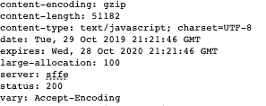

# HTTP 头|大分配

> 原文:[https://www . geesforgeks . org/http-headers-large-allocation/](https://www.geeksforgeeks.org/http-headers-large-allocation/)

**HTTP 大分配**头是一个响应类型的头，它通知受支持的浏览器(目前只有火狐)内存需求，使他们能够确保大分配成功，并使用一些未碎片化的内存启动一个新的进程。当浏览器试图分配 Unity 堆时内存溢出时，这证明是有用的。分配的大块连续内存可用于 asm.js 或 webAssembly 应用程序。像在线游戏一样，这个头基本上通知客户端浏览器，要加载的将执行一个大的连续内存分配，以便浏览器可以对未来的性能做好准备。

**语法:**

```html
Large-Allocation: <megabytes>
```

**注意:**向其他浏览器而不是火狐发送大分配头并不意味着任何不正确的事情。

**指令:**HTTML 大分配头接受一个指令，如上所述，如下所述:

*   **<兆字节> :** 该指令表示以兆字节为单位的值，指定将要执行的分配的大致大小。如果大小不确定，其值为 0。

**故障排除错误:**如果这个标题没有正确使用，它会抛出如下错误消息或警告:

*   如果页面将自己重新加载到应该有更多内存的新进程中，就会出现错误。
*   如果浏览器试图加载非 GET HTTP 头的文档，可能会出现错误。
*   如果浏览器没有在选项卡或用户打开的窗口的顶层打开文档，则可能会出现错误。
*   如果由于没有将文档加载到进程之外，文档忽略了此标题，则会出现错误。
*   如果用户运行的是非 win32 版本的 Firefox，可能会出现错误。

要检查大分配标题，请转到**检查元素- >网络**。查看如下回复标题



**例:**

*   在这个例子中，分配的大小是不确定的。

```html
Large-Allocation: 0
```

*   在这个例子中，将要执行的分配的大小是 2000 兆字节。

```html
Large-Allocation: 2000
```

**支持的浏览器:**浏览器兼容 **HTTP 大分配头**如下:

*   火狐 53