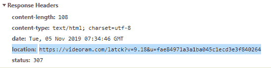

# HTTP 头|位置

> 原文:[https://www.geeksforgeeks.org/http-headers-location/](https://www.geeksforgeeks.org/http-headers-location/)

**HTTP Location** 头是在两种情况下使用的响应头，用于要求浏览器重定向 URL(状态代码 3xx)或提供关于新创建的资源的位置的信息(状态代码 201)。它的用法经常与另一个 HTTP 头 **HTTP 内容-位置**头混淆。它们之间的主要区别在于位置给出了页面重定向发生的资源的 URL，而 **HTTP Content-Location** 用于指示传输的资源的 URL。

**语法:**

```
Location: <url>
```

**指令:**该标题接受上面提到的和下面描述的单个指令:

*   **< url > :** 该指令保存访问资源的相对或绝对 url。

**示例:**

*   这些 URL 包括一个方案/主机，并且符合方案特定的语法和语义，这是一个**绝对 URL** :

    ```
    Location: https://www.geeksforgeeks.org/index.php
    ```

*   这些网址不包括方案或主机。必须结合原请求的网址，**相对网址** :

    ```
    Location: /blogs/
    ```

要检查该位置是否有效，请转到**检查元素- >网络**检查位置的响应标题，如下所示，位置高亮显示，您可以看到。

**支持的浏览器:**浏览器兼容 **HTTP 位置头**如下:

*   谷歌 Chrome
*   微软公司出品的 web 浏览器
*   微软边缘
*   火狐浏览器
*   歌剧
*   旅行队