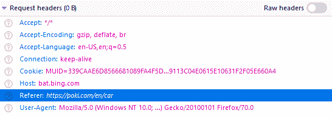

# http 标头|参考

> 哎哎哎:# t0]https://www . geeksforgeeks . org/http-headers-reference/

**HTTP referrer**头是一个请求类型的头，它标识前一个网页的地址，该地址链接到当前网页或被请求的资源。这种标题的使用增加了网站上隐私和安全漏洞的风险，但它允许网站和网络服务器识别流量来自哪里。如果资源是本地文件或数据，浏览器就不能发送引用。

**语法:**

```html
Referer: <url>
```

**指令:**HTTP 引用头接受一个指令，如上所述，如下所述:

*   **< url > :** 该指令是先前万维网页面的地址(部分或全部)，其后是指向当前请求页面的链接。

以下示例说明了 **HTTP 引用者**头:

**示例:**

*   在本例中，geeksforgeeks.org 是上一个网页的地址。

    ```html
    Referer: https://www.geeksforgeeks.org/
    ```

*   在本例中，google.com 是上一个网页的地址。

    ```html
    Referer: https://www.google.com/
    ```

要检查正在运行的推荐人，请转到**检查元素- >网络**检查推荐人的请求标题，如下所示。引用者标题突出显示。

**支持的浏览器:**与**兼容的浏览器**如下:

*   谷歌 Chrome
*   微软公司出品的 web 浏览器
*   微软边缘
*   火狐浏览器
*   歌剧
*   旅行队