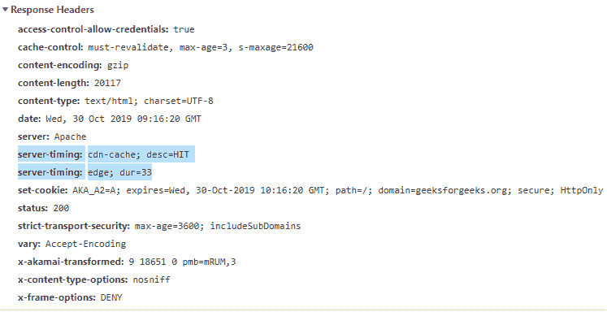

# HTTP 头|服务器计时

> 原文:[https://www.geeksforgeeks.org/http-headers-server-timing/](https://www.geeksforgeeks.org/http-headers-server-timing/)

**HTTP 服务器定时**头是一个响应类型的头。该报头用于在来自用户代理的给定请求-响应周期的两个或多个度量和描述之间进行通信。HTTP 服务器计时头对于任何后端服务器计时指标都很有用，例如在任何数据库中读取或写入、访问文件等。它可以在开发人员工具中使用，以跟踪 PerformanceServerTiming 接口上的服务器。HTTP 服务器计时有助于以不同的方式执行与指标的通信，如下所列:

*   度量名称
*   有价值的度量
*   带描述的度量
*   带有值和描述的度量

**语法:**

```html
Server-Timing: metricsname| metricsvalue | metricsdescription
```

**指令:**没有指令只需要提到指标名称和所有细节。

**示例:**

*   此示例显示了单个指标。

```html
Server-Timing: cdn-cache
```

*   此示例显示了值为的单个指标。

```html
Server-Timing: edge; dur=33
```

*   此示例显示了带有描述的单个指标。

```html
Server-Timing: cdn-cache; desc=HIT
```

*   此示例显示了具有描述和值的双重指标。

```html
Server-Timing: cdn-cache; desc=HIT, edge; dur=1
```

要检查此服务器定时是否正在运行，请转到**检查元素- >网络**检查服务器定时的响应头，如下所示，服务器定时会突出显示。



**支持的浏览器:**与 **HTTP 头服务器-定时**兼容的浏览器如下:

*   谷歌 Chrome
*   火狐浏览器
*   旅行队
*   歌剧