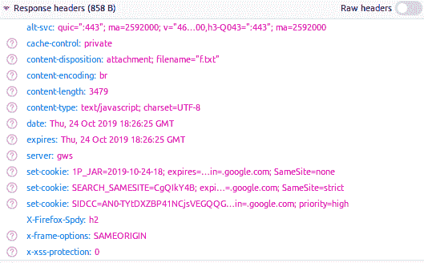

# HTTP 头|设置-Cookie

> 原文:[https://www.geeksforgeeks.org/http-headers-set-cookie/](https://www.geeksforgeeks.org/http-headers-set-cookie/)

**HTTP 头 Set-Cookie** 是一个响应头，用于将 Cookie 从服务器发送到用户代理。因此，用户代理可以稍后将它们发送回服务器，以便服务器可以检测到用户。

**语法:**

```html
Set-Cookie: <cookie-name>=<cookie-value> | Expires=<date> 
               | Max-Age=<non-zero-digit> | Domain=<domain-value>
               | Path=<path-value> | SameSite=Strict|Lax|none
```

**注意:**使用多个指令也是可以的。

**指令:**

*   **<cookie-name>=<cookie-value>:**cookie 名称得避开这个字符()@，；: \ " / [ ] ?= { }加上控制字符、空格和制表符。它可以是任何美国 ASCII 字符。
*   **过期= <日期> :** 这是一个可选指令，包含 cookie 的过期日期。
*   **Max-Age= <非零数字> :** 它以秒的数字格式包含寿命，零或负值会使 cookie 立即过期。
*   **域= <域值> :** 该指令定义了发送 cookie 的主机。这是一个可选指令。
*   **路径= <路径值> :** 该指令定义了一个必须存在于请求的网址中的路径，否则浏览器无法发送 cookie 头。
*   **same site = Strict | Lax | none:**该指令提供了一些针对跨站点请求伪造攻击的保护。

**示例:**

*   当用户关闭系统时，这种类型的 cookie 被删除。这种类型的 cookie 称为会话 cookie。

    ```html
    Set-Cookie: sessionId=38afes7a8
    ```

*   永久饼干在某个特定日期过期

    ```html
    set-cookie: 1P_JAR=2019-10-24-18; expires=…in=.google.com; SameSite=none
    ```

要检查此设置 Cookie 的运行情况，请转到检查**元素- >网络**检查设置 Cookie 的响应头。



**支持的浏览器:**与 **HTTP 头集-Cookie** 兼容的浏览器如下:

*   谷歌 Chrome
*   微软公司出品的 web 浏览器
*   火狐浏览器
*   旅行队
*   歌剧