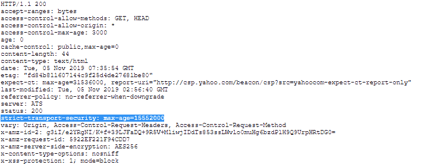

# HTTP 头|严格-传输-安全

> 原文:[https://www . geesforgeks . org/http-headers-strict-transport-security/](https://www.geeksforgeeks.org/http-headers-strict-transport-security/)

**HTTP 严格传输安全(HSTS)** 是一种 web 安全策略机制，有助于保护网站免受恶意活动的攻击，并通过响应头通知用户代理和 web 浏览器如何处理其连接。每当一个网站通过 HTTP 连接，然后重定向到 HTTPS，就会创造一个中间人攻击的机会，重定向会将用户引向恶意网站，因为用户首先必须与网站的非加密版本进行通信。服务器通过在 HTTPS 连接上提供报头来实现 HSTS 策略，该报头通知浏览器使用 HTTPS 而不是 HTTP 加载站点。

**语法:**

```html
Strict-Transport-Security: max-age=<expire-time>
```

```html
Strict-Transport-Security: max-age=<expire-time>; includeSubDomains
```

```html
Strict-Transport-Security: max-age=<expire-time>; preload
```

**指令:**

*   **<过期时间> :** 这是指用户代理或浏览器只能使用 HTTP 以安全方式访问服务器的时间(以秒为单位)。
*   **包含域:**这将指导浏览器将规则应用于网站的所有页面和子域。
*   **预加载:**这对于包含在大多数主要网络浏览器的 HSTS 预加载列表中是必要的。

**解释:**如果用户在地址栏中键入*http://www.geeksforgeeks.com/*或*geeksforgeeks.com*，这将为中间人攻击创造机会。重定向可能被利用来引导访问者到恶意站点，而不是原始站点的安全版本。

**示例:**

```html
Strict-Transport-Security: max-age=3600; includeSubDomains
```

所有网页和子域将是 HTTPS 的最大年龄为 1 小时。这将阻止对无法通过 HTTPS 提供服务的页面或子域的访问。

```html
Strict-Transport-Security: max-age=7200; includeSubDomains; preload

```

所有现在和未来的子域将是 HTTPS，最长时间为 2 小时。它也有预加载作为后缀，这在大多数主要的网络浏览器的 HSTS 预加载列表中是必要的。

要检查严格-传输-安全的运行情况，请转到**检查元素- >网络**检查严格-传输-安全的响应头如下所示，严格-传输-安全突出显示，您可以看到。

**支持的浏览器:**以下浏览器兼容 **HTTP 严格-传输-安全。**

*   谷歌 Chrome 4.0
*   Internet Explorer 11.0
*   Firefox 4.0
*   Safari 7.0
*   Opera 12.0