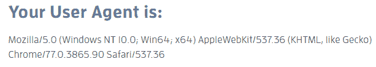

# HTTP 头|用户代理

> 原文:[https://www.geeksforgeeks.org/http-headers-user-agent/](https://www.geeksforgeeks.org/http-headers-user-agent/)

**HTTP 头用户代理**是一个请求头，它允许一个特征字符串，该字符串允许网络协议对等方识别网络服务器的操作系统和浏览器。您的浏览器会将用户代理发送到您连接的每个网站。编写用户代理字符串没有传统的方法，因为不同的浏览器使用不同的格式，并且许多 web 浏览器将大量信息加载到它们的用户代理上。
当您的浏览器连接到网站时，HTTP 头中会包含一个用户代理字段。标题字段的数据因浏览器而异。这些信息用于为不同的网络浏览器和不同的操作系统提供不同的网站。

**语法:**

```
User-Agent: <product> / <product-version> <comment>
```

或者

```
User-Agent: Mozilla/<version> (<system-information>) <platform> (<platform-details>) 
<extensions>
```

**指令**在 HTTP 头中有三个指令用户代理。

*   **产品:**这个持有产品身份。
*   **产品-版本:**此处保存使用产品的产品版本。
*   **备注:**保存使用产品的子产品信息

您也可以在[http://whatsmyuseragent.com/](http://whatsmyuseragent.com/)的帮助下查看您的**用户代理**。



**示例:**

> Mozilla/5.0(Windows NT 10.0；Win64x64)applebwebkit/537.36(KHTML，像 Gecko)Chrome/77 . 0 . 3865 . 90 Safari/537.36

借助用户代理头可以得出以下结论:

*   用户代理应用程序是 Mozilla 版本。
*   操作系统是 10.0 版(运行在 Windows(64 位)机器上)。
*   负责在此设备上显示内容的引擎是 AppleWebKit 版本 537.36(也存在开源布局引擎 KHTML)。
*   客户端是 Chrome 版本 77.0.3865.90。
*   客户端基于 Safari 537.36 版本。

**示例:**

*   **Mozilla:**

    ```
    Mozilla/5.0 (Windows NT 6.1; Win64; x64; rv:47.0) Gecko/20100101 Firefox/47.3
    Mozilla/5.0 (Macintosh; Intel Mac OS X x.y; rv:42.0) Gecko/20100101 Firefox/43.4
    ```

*   **铬∶**

    ```
    Mozilla/5.0 (X11; Linux x86_64) AppleWebKit/537.36 (KHTML, like Gecko) Chrome/77.0.3865.90 Safari/537.36
    ```

*   **狩猎:**

    ```
    Mozilla/5.0 (iPhone; CPU iPhone OS 11_3_1 like Mac OS X) AppleWebKit/603.1.30 (KHTML, like Gecko) 
    Version/10.0 Mobile/14E304 Safari/602.1
    ```

**支持的浏览器:**与 **HTTP 头用户代理**兼容的浏览器如下:

*   谷歌 Chrome
*   微软公司出品的 web 浏览器
*   火狐浏览器
*   旅行队
*   歌剧