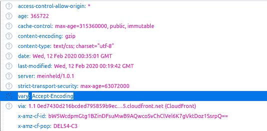

# HTTP 头|变化

> 原文:[https://www.geeksforgeeks.org/http-headers-vary/](https://www.geeksforgeeks.org/http-headers-vary/)

**HTTP Vary 头**是一个响应类型的头。它用于指示在内容协商算法中选择资源表示时使用了哪些头，并确定如何匹配未来的请求头，以决定是否可以使用缓存的响应，而不是从源服务器请求新的响应。如果您想为移动用户提供不同的内容，那么它可以帮助避免缓存错误地为移动用户提供桌面版本的网站。它将帮助搜索引擎发现页面的移动版本。

**语法:**

```
Vary: *
```

运筹学

```
Vary: <header-name>
```

**指令:**HTTP 头接受的指令有两种，各不相同。

*   ***:** 此通配符指令将用于匹配所有未来的请求头，以决定是否缓存响应。
*   **<头-名称> :** 该指令保存头名称，也可以保存多个头，这些头将用于匹配未来的请求头，以决定是否缓存响应。

**示例:**

```
Vary: Accept-Encoding
```

```
Vary: User-Agent
```

要检查此变化，请转到**检查元素- >网络**检查变化的响应标题，如下所示，变化高亮显示，您可以看到。

 **支持的浏览器:**与**兼容的浏览器各不相同**如下:

*   谷歌 Chrome
*   微软公司出品的 web 浏览器
*   火狐浏览器
*   旅行队
*   歌剧