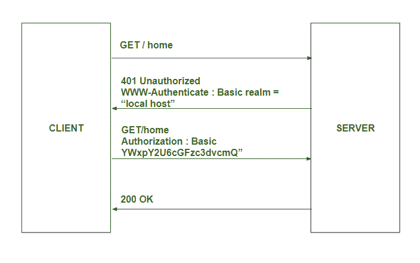

# HTTP 头| WWW-认证

> 原文:[https://www . geesforgeks . org/http-headers-www-authenticate/](https://www.geeksforgeeks.org/http-headers-www-authenticate/)

**HTTP WWW-Authenticate 头**是响应类型的头。它支持各种身份验证机制，这些机制对于控制对页面和其他资源的访问也很重要。所有这些机制都基于使用 **401 状态代码**。 **HTTP WWW-Authenticate** 响应头定义了用于访问资源的身份验证方法。如前所述，**万维网认证报头**与 401 未授权响应一起发送。

该工作包括由具有 401 未授权响应状态的服务器响应的客户端，该服务器使用包含至少一个挑战的 **WWW-Authenticate 响应报头**提供关于授权的信息。想要向服务器进行身份验证的客户端可以通过在凭据中包含授权请求头字段来进行身份验证。通常，这是通过向用户显示密码提示，然后发出包含正确授权标题的请求来完成的。

基本身份验证的图示如下:



这里，是身份验证方案(“基本”是最常见的方案，将在下面介绍)。该领域用于解释保护区或指出保护范围。这可能是类似“访问临时站点”或类似的消息，以便用户知道他们试图访问哪个空间。

**注意:**注意:在如图所示的“基本”身份验证的情况下，交换必须通过 HTTPS (TLS)连接进行，以确保安全。

需要指定使用哪种身份验证方案，以便希望授权的客户端知道如何提供凭据。

**语法:**

```html
WWW-Authenticate: <type> realm=<realm> realm=<realm>
```

**指令:**该标题接受三个指令，如上所述，如下所述:

*   **<类型> :** 本指令持有认证类型。常见的类型是“基本”。IANA 有一份认证方案清单。
*   **领域= <领域> :** 本指令描述了保护区。默认情况下，使用格式化的主机名。
*   **字符集= <字符集> :** 在提交用户名和密码时告诉客户端服务器的首选编码方案。唯一允许的值是不区分大小写的字符串“UTF-8”。这与领域字符串的编码无关。

**示例:**

```html
WWW-Authenticate: Basic
```

```html
WWW-Authenticate: Basic realm="Access to the staging site", 
charset="UTF-8"
```

**支持的浏览器:****HTTP 头 WWW-Authenticate** 支持的浏览器如下:

*   谷歌 Chrome
*   微软边缘
*   Mozilla Firefox
*   微软公司出品的 web 浏览器
*   歌剧
*   旅行队