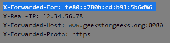

# HTTP 头| X-转发-用于

> 原文:[https://www.geeksforgeeks.org/http-headers-x-forwarded-for/](https://www.geeksforgeeks.org/http-headers-x-forwarded-for/)

HTTP 头用于客户端和服务器之间的通信。HTTP 头允许客户端和服务器通过 HTTP 请求或响应传递附加信息。**X-forward-For**标头是请求类型标头，是 Forwarded 标头的替代和事实上的标准版本，当客户端通过 HTTP 代理或负载平衡器连接到网络服务器以识别原始 IP 地址时使用。用户的隐私面临风险，因为敏感信息是通过使用此标题泄露的。HTTP X-forward-For 标头用于标识客户端的原始 IP 地址。超文本传输协议转发头的修改版本是超文本传输协议转发头。

**语法:**

```html
X-Forwarded-For: <client>, <proxy>
```

**注意:**也可以有多个代理。

**指令:**HTTP X-forward-For 接受两个指令，如上所述，如下所述:

*   **<客户端> :** 是客户端的 IP 地址。
*   **<代理> :** 请求必须经过的是代理。如果有多个代理，则列出每个连续代理的 IP 地址。

**示例:**

*   这是一个请求必须通过多个代理的例子。

    ```html
    X-Forwarded-For: 103.0.113.165, 60.91.3.17, 120.192.338.678
    ```

*   这是一个请求必须通过一个代理的例子。

    ```html
    X-Forwarded-For: fe80::780b:cd:b91:5b6d%6
    ```

要检查转发的操作，请转到检查元素->网络检查转发的请求头，如下所示。

**支持的浏览器:**浏览器的 **HTTP 头的兼容性仍然未知。**