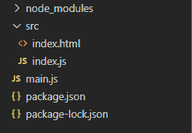
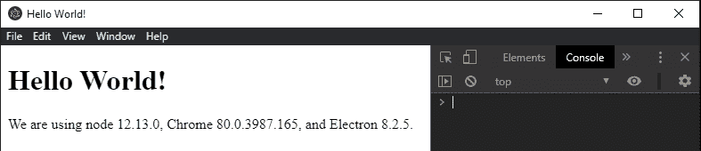
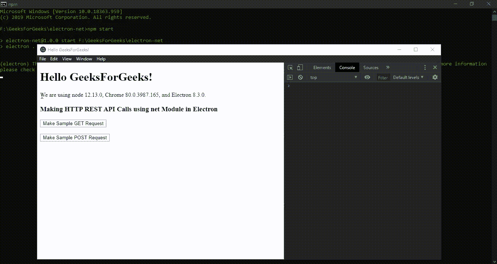

# 电子 JS 中的 HTTP REST API 调用

> 原文:[https://www . geesforgeks . org/http-rest-API-calls-in-electronijs/](https://www.geeksforgeeks.org/http-rest-api-calls-in-electronjs/)

[**electronijs**](https://www.geeksforgeeks.org/introduction-to-electronjs/)是一个开源框架，用于使用能够在 Windows、macOS 和 Linux 操作系统上运行的 HTML、CSS 和 JavaScript 等网络技术构建跨平台的本机桌面应用程序。它将铬引擎和[T5 节点 T7】结合成一个单一的运行时。](https://www.geeksforgeeks.org/introduction-to-nodejs/)

我们已经知道 **HTTP REST API 的**在任何系统中的重要性。它们在全球各地都有使用，互联网上也有专门的资源，涵盖了 HTTP REST 应用编程接口、标准和协议的所有细节。HTTP REST 的一些比较著名的资源在这里提到[，在这里](https://restfulapi.net/)提到[。 **NodeJS** 通过内置模块和外部包提供了对 HTTP REST API 调用的广泛支持。NodeJS 为我们提供了内置的](https://developer.wordpress.org/rest-api/) [**HTTP**](https://nodejs.org/api/http.html) 和 [**HTTPS**](https://nodejs.org/api/https.html) 模块，NodeJS 中使用的一些最著名的 [npm](https://www.geeksforgeeks.org/node-js-npm-node-package-manager/) 包有[**axios**](https://www.npmjs.com/package/axios)[**请求**](https://www.npmjs.com/package/request) 和 [**node-fetch**](https://www.npmjs.com/package/node-fetch) 。由于 electronic 本质上是一个节点应用程序，所有上述包都受到支持，并且也可以在 electronic 中使用。关于如何使用电子中的 **axios** 包进行 REST API 调用的简短教程，请参考文章: [**电子中的地理信息**](https://www.geeksforgeeks.org/geo-information-in-electronjs/) 。除此之外，电子还为此向我们提供了一个内置的**网**模块。**网络**模块用于使用 Chromium 的本地网络库发出 HTTP/HTTPS REST 请求。本教程将演示如何使用**网络**模块以及**网络**模块的优势和特点在电子中进行 HTTP REST API 调用。

我们假设您熟悉上述链接中介绍的先决条件。电子要工作， [**节点**](https://www.geeksforgeeks.org/introduction-to-nodejs/) 和 [**npm**](https://www.geeksforgeeks.org/node-js-npm-node-package-manager/) 需要预装在系统中。
**网络**模块是电子商务中用于发布 **HTTP/HTTPS** 请求的客户端应用编程接口。如上所述，它类似于 NodeJS 的 **HTTP** 和 **HTTPS** 模块，但是它使用 Chromium 的本地网络库而不是 NodeJS 实现，因此为 web 代理提供了更好的支持。**网络**模块的其他一些优点是:

*   自动管理系统代理配置，支持**WPAD(****)**协议和代理 pac 配置文件。
*   HTTPS 请求的自动隧道传输。
*   支持使用基本、摘要、NTLM、Kerberos 或协商身份验证方案对代理进行身份验证。
*   支持流量监控代理:类似 Fiddler 的代理，用于访问控制和监控。

*   **项目结构:**



**示例:**按照 [**中给出的步骤，设置基本的电子应用程序。复制文章中提供的 **main.js** 文件和**index.html**文件的样板代码。还要对**包. json** 文件进行必要的更改，以启动电子应用程序。我们将继续使用相同的代码库构建我们的应用程序。设置电子应用程序所需的基本步骤保持不变。
**package . JSON:****](https://www.geeksforgeeks.org/dynamic-styling-in-electronjs/) 

```html
{
  "name": "electron-net",
  "version": "1.0.0",
  "description": "Making HTTP REST API Calls - net Module in Electron ",
  "main": "main.js",
  "scripts": {
    "start": "electron ."
  },
  "keywords": [
    "electron"
  ],
  "author": "Radhesh Khanna",
  "license": "ISC",
  "dependencies": {
    "electron": "^8.3.0"
  }
}

```

**输出:**

[](https://media.geeksforgeeks.org/wp-content/uploads/20200512225834/Output-1105.png)

电子中的 HTTP REST API 调用电子中的**网络**模块是**主进程**的一部分。要导入并使用**渲染器流程**中的**网络**模块，我们将使用电子**远程**模块。在本教程中，我们使用了[**【httpbin.org】**](http://httpbin.org/#/)，这是一个简单免费的第三方 HTTP REST Request &响应服务。它提供了示例 HTTP REST API，这些 API 是公开可用的，不需要任何身份验证和授权。它还通过示例 REST API 提供了许多其他功能，如身份验证测试、重定向、cookies、动态和随机数据等。我们将使用**网络**模块，出于演示目的，对此服务提出 HTTP **GET** 和 HTTP **POST** 请求。**网络**模块中使用的所有组件，包括实例方法、实例事件和实例属性等设计和实现，都类似于 NodeJS 实现。该**网**模块只有在 **app** 模块的**就绪**事件发出后才能使用。所有操作系统平台和环境都支持此模块。

*   **index.html**:在该文件中添加以下片段。

## 超文本标记语言

```html
<h3>Making HTTP REST API Calls 
    using net Module in Electron
</h3>
  <button id="get">
    Make Sample GET Request
  </button>
  <br><br>
  <button id="post">
    Make Sample POST Request
  </button>
<!-- Adding Individual Renderer
     Process JS File -->
<script src="index.js"></script>
```

*   **index . js**:**发出样本获取请求**和**发出样本发布请求**按钮还没有任何相关功能。

## java 描述语言

```html
const electron = require('electron');
// Importing the net Module from electron remote
const net = electron.remote.net;

var get = document.getElementById('get');
get.addEventListener('click', () => {
    const request = net.request({
        method: 'GET',
        protocol: 'http:',
        hostname: 'httpbin.org',
        path: '/get',
        redirect: 'follow'
    });
    request.on('response', (response) => {
        console.log(`STATUS: ${response.statusCode}`);
        console.log(`HEADERS: ${JSON.stringify(response.headers)}`);

        response.on('data', (chunk) => {
            console.log(`BODY: ${chunk}`)
        });
    });
    request.on('finish', () => {
        console.log('Request is Finished')
    });
    request.on('abort', () => {
        console.log('Request is Aborted')
    });
    request.on('error', (error) => {
        console.log(`ERROR: ${JSON.stringify(error)}`)
    });
    request.on('close', (error) => {
        console.log('Last Transaction has occured')
    });
    request.setHeader('Content-Type', 'application/json');
    request.end();
});

var post = document.getElementById('post');
post.addEventListener('click', () => {
    var body = JSON.stringify({ key: 1 });
    const request = net.request({
        method: 'POST',
        protocol: 'http:',
        hostname: 'httpbin.org',
        path: '/post',
        redirect: 'follow'
    });
    request.on('response', (response) => {
        console.log(`STATUS: ${response.statusCode}`);
        console.log(`HEADERS: ${JSON.stringify(response.headers)}`);

        response.on('data', (chunk) => {
            console.log(`BODY: ${chunk}`)
        });
    });
    request.on('finish', () => {
        console.log('Request is Finished')
    });
    request.on('abort', () => {
        console.log('Request is Aborted')
    });
    request.on('error', (error) => {
        console.log(`ERROR: ${JSON.stringify(error)}`)
    });
    request.on('close', (error) => {
        console.log('Last Transaction has occured')
    });
    request.setHeader('Content-Type', 'application/json');
    request.write(body, 'utf-8');
    request.end();
});
```

**说明:****网**模块只支持一种实例方法。此**网络请求(选项)**实例方法使用**客户端请求**实例。对该实例方法的每次调用都会创建并返回一个**新的客户端请求**实例。此实例方法用于根据**选项**对象中指定的协议方案发出安全和不安全的 HTTP 请求。有关 **net.request()** 方法的更多详细信息。它接受以下参数。

*   **选项:****对象/字符串**该参数可以接受一个**对象**或一个简单的**字符串**值。这表示**客户端请求**构造器选项，并被直接转发到**客户端请求**实例。如果该参数为**字符串**，则解释为请求**网址**。如果它是一个**对象**，它应该完全指定一个 **ClientRequest** 构造函数支持的 HTTP 请求。

上述代码中进一步使用的所有实例方法、事件和属性都是 **ClientRequest** 实例的一部分。**客户端请求**实例发出实际的 HTTP/HTTPS 请求，并实现 [**可写流**](https://nodejs.org/api/stream.html#stream_writable_streams) 接口，因此是一个 [**事件发射器**](https://nodejs.org/api/events.html#events_class_eventemitter) 。**客户端请求**构造器选项的详细说明如下。它支持以下参数:

*   **方法:**此参数指定 HTTP 请求方法。默认为 HTTP **GET** 方法。
*   **URL:** 此参数指定 HTTP 请求 URL。该参数必须以绝对形式提供，协议指定为 **http:** 或 **https:** 。如果未提供协议，则不会设置默认值，因此 HTTP 请求将会失败。对于简单的 HTTP **GET** 请求，指定**方法**和 **url** 参数就足以进行调用。网址参数还可以进一步分解成其他参数。
*   **会话:**此参数指定请求关联的电子 [**会话**](https://www.electronjs.org/docs/api/session) 实例。
*   **分区:字符串(可选)**该参数指定从请求关联的**会话**实例派生的**分区**的名称。默认值是一个**空字符串**。如果**会话**参数和**分区**参数一起定义，**会话**参数优先。因此，如果明确指定并传递了**会话**实例，**分区**参数将被忽略。
*   **useSessionCookies:** 此参数指定是否发送带有此请求的**cookie**，该请求源自**会话**实例。这将使 **net** 模块请求的 cookie 行为与 NodeJS **提取**请求相匹配。默认值为**假**。
*   **协议:字符串(可选)**此参数指定 HTTP 请求的协议方案。目前支持的值有 **http:** 或 **https:** 。默认值为 **http:** 。该参数严格遵循 [**URL**](https://nodejs.org/api/url.html) 模块中描述的 NodeJS 模型。
*   **主机:**此参数指定服务器主机，即以**主机名:端口**的格式提供的基本网址，该网址由**主机名**参数和**端口**号码参数串联而成，如网址标准所述。该参数严格遵循 [**URL**](https://nodejs.org/api/url.html) 模块中描述的 NodeJS 模型。
*   **主机名:字符串(可选)**此参数指定服务器主机名。可以是**域名系统**(域名服务)服务器名称或 **IP** 地址。该参数严格遵循 [**网址**](https://nodejs.org/api/url.html) 模块中描述的 NodeJS 模型。
*   **端口:整数(可选)**此参数指定服务器的监听端口号。该参数严格遵循 [**网址**](https://nodejs.org/api/url.html) 模块中描述的节点模型。
*   **路径:字符串(可选)**该参数指定请求网址的路径部分，即在基本网址**主机名/主机/端口**参数之后的部分。该参数可以包含需要传递给 REST API 的**查询字符串**参数或**路径**参数。**查询字符串**参数定义在**之后？**在网址中有一个键值对。该参数严格遵循 [**URL**](https://nodejs.org/api/url.html) 模块中描述的 NodeJS 模型。
*   **重定向:字符串(可选)**此参数定义了 HTTP 请求的重定向模式。它可以保存以下任何值:
    *   **遵循**遵循 HTTP 请求的默认行为。
    *   **错误**中止 HTTP 请求中的任何或所有重定向。
    *   **手动**取消重定向，除非在发出**重定向**实例事件的同时**同步调用**请求. followRedirect()** 实例方法。**

**客户端请求**实例支持以下实例事件。

*   **响应:事件**这个 Instance 事件在 HTTP 请求处理完毕后发出，并从 REST API 返回一个响应。该实例事件在**网络**模块对象上发出(在本例中，**请求**对象)。它返回一个单独的**响应:对象**，表示传入的 HTTP 响应包，包括 HTTP 状态、HTTP 头、HTTP 体等。
*   **完成:事件**该实例事件在接收到最后一个 HTTP 请求数据块并写入**请求**对象后发出。
*   **中止:事件**当 HTTP **请求**中止时，会发出此实例事件。如果**请求**已经关闭，即**关闭**实例事件已经触发，则不会发出此事件。
*   **错误:事件**当**网**模块无法发出 HTTP 网络请求时，会发出此实例事件，这可能是由于各种原因造成的，如网关不良、没有网络连接等。典型地，当**请求**对象发出**错误**实例事件时，紧接着也会发出**关闭**实例事件，并且不会提供**响应**对象。此事件返回一个**错误**对象，该对象包含一些关于 HTTP 请求失败的信息，如 HTTP 状态代码等。
*   **关闭:事件**握手完成后，该实例事件作为 HTTP 请求-响应事务中的最后一个事件发出。该事件表示不会在**请求**或**响应**对象上发出进一步的事件，并将交易标记为完成。

此外，**客户端请求**实例支持单个实例属性。

*   **request.chunkedEncoding** 该实例属性采用**布尔**值。此属性指定 HTTP 请求是否将使用 HTTP 分块传输编码。该属性只能在第一次写操作之前设置，即在 **request.write()** 实例方法之前，因为 HTTP 头还没有上线。在第一次写入后试图设置 **chunkedEncoding** 属性会引发错误。默认值为假。如果您需要发送一个大的请求体，强烈建议使用 **chunkedEncoding** 实例属性作为 **true** ，因为数据将以小块的形式传输，而不是在电子进程内存中进行内部缓冲。

基于 **ClientRequest** 构造函数选项和我们到目前为止所掩盖的实例事件和属性，我们注意到 HTTP 请求的一些关键参数丢失了，例如 HTTP POST 请求的**头**和**体**。这是因为这些参数从以前版本的 Electron 的构造函数**选项**对象中移除，并在新版本中作为单独的实例方法添加。 **ClientRequest** 实例支持以下实例方法。

*   **request.setHeader(名称，值)**这个 Instance 方法用于添加一个额外的 HTTP 头或覆盖除默认 HTTP 头之外的现有头。标题名称将按原样使用，而不会降低。只能在第一次写之前调用，即在调用 **request.write()** 实例方法之前。在第一次写入后调用此方法将引发错误。如果传递的值不是字符串，将调用其 **toString()** 方法，在设置 HTTP 请求包的头之前获取最终值。
*   **request.getHeader(name)** 该实例方法用于返回在**名称:字符串**参数中传递的头的值。返回值是包含该值的字符串。
*   **request.removeHeader(名称)**该实例方法用于移除在**名称:字符串**参数中传递的标头。只能在第一次写之前调用，即在调用 **request.write()** 实例方法之前。在第一次写入后调用此方法将引发错误。此方法不返回值。
*   **request.write(区块、编码、回调)**这个 Instance 方法向请求体添加一个数据区块。这个实例方法是我们设置 HTTP POST 请求的**主体**的地方。第一次写操作可能会导致在线发出请求头。第一次写入操作后，不允许添加或删除自定义标头。它采用以下参数:
    *   **区块:字符串/缓冲区**请求体数据的区块。如果是**字符串**值，则使用**编码**参数中指定的编码将其内部转换为**缓冲区**。
    *   **编码:字符串(可选)**如上所述，该参数用于将**组块**参数**字符串**值转换为**缓冲区**对象。用于编码的默认值是 **utf-8** ，这是通过网络传输 HTTP 请求时使用的默认编码。
    *   **回调:函数(可选)**这个回调函数本质上是为了与 NodeJS API 保持相似性而引入的一个伪函数。在块内容被传送到铬网络层之后，它被异步地称为**。**
*   ****request.abort()** 此实例方法如果被调用，将取消正在进行的 HTTP 事务。如果已经发出**关闭**实例事件，该实例方法将不起作用。否则**中止**和**关闭**实例事件被发出。另外，如果有正在进行的**响应**对象，它也会发出**中止**实例事件。**
*   ****request.followRedirect()** 此实例方法继续，并强制执行任何挂起的 HTTP 请求重定向。该实例方法只能在发出**重定向**实例事件时调用。**

**此时，在启动电子应用程序时，我们应该能够对**httpbin.org**HTTP 服务、**获取**和**发布**示例 API 进行成功的 HTTP REST API 调用，并检查我们从这些 API 获得的响应。
**输出:****

**[](https://media.geeksforgeeks.org/wp-content/uploads/20200724003452/Output-1-GIF17.gif)**