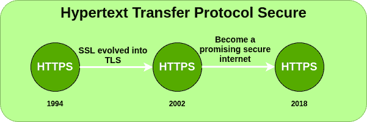

# HTTPS 全形态

> 原文:[https://www.geeksforgeeks.org/https-full-form/](https://www.geeksforgeeks.org/https-full-form/)

**HTTPS** 代表**超文本传输协议安全**。HTTP Secure (HTTPS)，可以是超文本传输协议和 SSL/TLS 约定的组合，以提供加密通信和一个已安排的网络服务器的安全区别证明。
如果那个网站的网址仅仅是 HTTP，那么你正在阅读的任何东西或者你在那个网站上放的任何感兴趣的东西，都极有可能是程序员需要获取你的数据。
因此，HTTPS 比 HTTP 更安全，因为 HTTPS 通过了 SSL(安全套接字层)认证。无论你在互联网上访问什么网站，如果它的网址是 HTTP，那么这个网站是不安全的。
如果一个网站安装了 SSL 证书，那么该网站的网址将是 HTTPS，该网站将完全安全。你可以提供任何关于你的信用卡、借记卡、动态口令和其他信息。

#### 改进年份:

#### HTTPS 的特点:

*   **安全:**如今网络上有很多网络攻击。网上分期付款也扩大了。这就是为什么我们需要安全。如果任何网站都没有安全性，那么没有人会使用该网站。
*   **SSL 的需求:**一些 SEO 专家认为，通过在网站上引入 SSL，谷歌有一些 SEO 优势。通过应用 SSL，该网站在谷歌的定位得到了进一步提升。
*   **认证:** HTTPS 加密所有消息内容，包括 HTTP 头和请求/响应数据。HTTPS 的验证观点要求可信第三方签署服务器端数字证书。
*   **私下浏览:** HTTPS 目前被网络客户比第一个非安全 HTTP 更频繁地使用，基本上是为了确保各种网站的页面真实性，保护账户和保持客户通信。

#### HTTPS 的优势:

*   保护您传输中的信息。
*   帮助您提高每位客户的收入。
*   保护您的网站免受网络钓鱼、MITM 和其他信息泄露。
*   建立对网站访问者的信任。删除“不安全”警告。
*   帮助你提升网站排名。

#### HTTPS 的缺点:

*   HTTPS 的网络询问速度较慢，这通常发生在适度的页面堆叠中。
*   带有 HTTPS 的页面永远无法缓存，可能是共享缓存。
*   一些中介服务或防火墙框架不允许进入 HTTPS 的地区。
*   如果你制作的网站有静态内容或者没有私人信息交流，你会选择 HTTP。
*   开销包括加密和解码信息的时间、加密信息的额外报头输入、最近交换真实信息的握手时间。