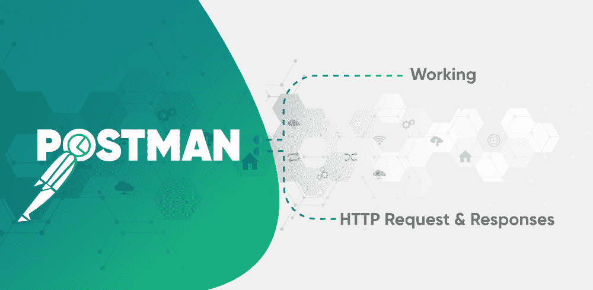
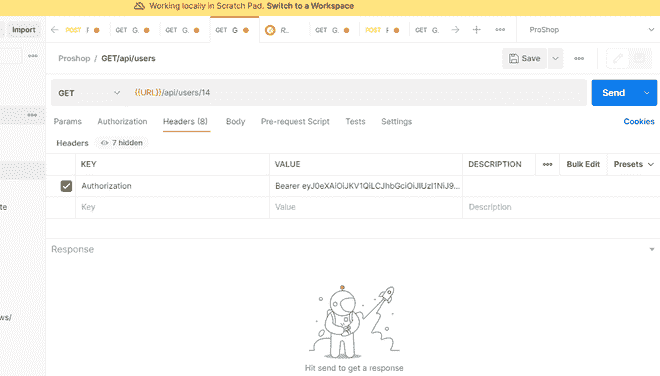

# 邮递员工作，HTTP 请求&响应

> Original: [https://www.geeksforgeeks.org/postman-working-http-request-responses/](https://www.geeksforgeeks.org/postman-working-http-request-responses/)

**接口**…。 **应用编程接口**…。 如果你是一名开发人员，那么这个词对你来说就不是什么新鲜事了，…

作为一名开发人员，您知道 API 在任何类型的应用程序中的重要性。 简单地说，API 是一组定义的规则和一些定义的通信方法。 在 API 的帮助下，软件组件可以相互交互。 您可能已经在应用程序中实现了某种 API(如支付网关 API)。

要在不影响代码质量的情况下确保快速开发，实现高质量的 API 非常重要。 在开发人员中，最好、最受欢迎的 API 测试工具是**Postman**。

在 API 测试中，我们测试 API 集合，并检查您的应用程序是否满足对功能、可靠性、性能和安全性的期望。 此外，我们还检查它是否返回正确的响应。

在 API 测试中，我们检查输出是否结构良好，是否对其他应用程序有用。 根据输入参数，我们检查响应，并确定 API 提取数据并将数据授权给它所用的时间。

### **邮递员如何工作？**

邮递员将请求发送到 Web 服务器，然后服务器将响应发回给它。 用户必须设置 API 期望检查响应的所有头部和 cookie。

您可以通过链接[Postman](https://www.getpostman.com/apps)安装邮递员。 该工具提供了一组 API 调用，您需要跟随这些 API 调用来测试应用程序的 API。 您会发现一个包含多种方法的下拉列表。

您可以从给定的下拉列表中选择其中一种方法。 您还必须根据 API 调用包括更多信息。 此信息设置为授权、标题或正文信息。 您只需选择其中一种方法，然后发送请求并获得响应。

### 邮递员中的环境变量

邮递员的一些要求需要一些具体的信息。 您可以一次更改所有这些变量，而不是手动更改端点中的变量。

在右上角，您将获得设置环境变量的选项。 您可以按照下面给出的步骤设置环境变量。

1.  在右上角，单击从设置管理环境。
2.  单击添加按钮。
3.  提及环境名称。
4.  提到关键和价值。 这将在稍后用作集合中的变量。

### **添加集合**

集合是请求的捆绑包。 要创建集合，可以在集合中添加 API 调用。 您可以在您的应用程序中重用它。 很多组织都提供收藏。 您可以将其导入您的邮递员并进行测试。 如果您已经创建了集合，则可以将其导出；如果您想要其他集合，则可以将其导入。

您的应用编程接口调用主要使用两件事…

### **1.HTTP 请求**

您通过发送 HTTP 请求进行 HTTP 调用。 在 HTTP 请求方法中包括**请求方法、请求 URL、请求头、请求正文、请求前脚本和测试**。

让我们逐一介绍一下这些请求方法，…。 *

**请求方法：**您将在邮递员中找到几种类型的请求方法。 根据您的需求或测试，您可以选择其中之一。 您将在应用程序中主要使用四种请求方法。 这些方法在下面的…中给出

*   **GET 请求：**检索或获取数据
*   **POST 请求：**创建和更新数据
*   **PUT REQUEST；**更新数据
*   **删除请求：**删除数据

**请求 URL：**您将在 Postman 中找到一个长条，您必须在其中输入 URL 才能发出 HTTP 请求。

**请求头：**在请求头中，您可以输入应用程序的密钥值。 下面给出了两个主键值。

*   **Content-Type：**数据格式由 Content-Type 指定。 开发人员主要在内容类型中使用 JSON 格式。
*   **授权：**包含此信息是为了识别请求者。

**Request Body：**在 Postman 中，您会看到 Body 的页签，您可以在页签中提到需要随请求一起发送的一些具体信息。 您可以选择以原始、二进制或任何其他形式发送数据。 大多数情况下，您将选择原始表单。 您还可以选择预请求脚本。 这是在发送请求之前执行的。 在 Postman 中，您还可以为每个请求编写和运行测试。 您可以使用 JavaScript 语言来实现这一点。

### 2.HTTP 响应

将请求发送给 Postman 后，您将从 API 返回响应，其中包含 Body、Cookie、Header、Tests、Status Code 和 API 响应时间。 正文和页眉被组织在不同的选项卡中。 状态代码显示在另一个选项卡中，显示完成 API 调用所需的时间。 下面给出了一些重要的状态代码来验证响应。

*   **200**-表示请求成功。
*   **201**-请求成功，数据已创建
*   **204**-用于空响应
*   **400**-错误请求。
*   **401**-用于未经授权的访问。 身份验证失败或用户没有请求操作的权限。
*   **403**-如果禁用，则拒绝访问
*   **404**-未找到数据。
*   **405**-不允许或请求的方法不支持。
*   加入时间：清华大学 2007 年 01 月 25 日下午 3：33
*   **503**-服务不可用

从上面的解释中，你可能已经了解了邮递员的很多事情。 它是如何工作的，如何用于测试、请求、响应，以及所有状态代码。 Postman 是最受开发人员欢迎的 API 测试工具。 还有很多其他的工具，你也可以试试，但最受欢迎的是 Postman，它流行的背后原因是它包含了很多功能。