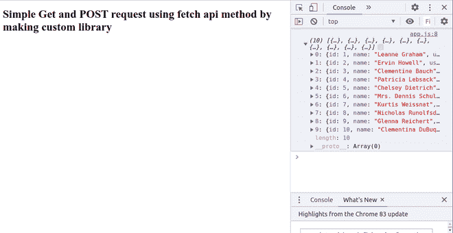
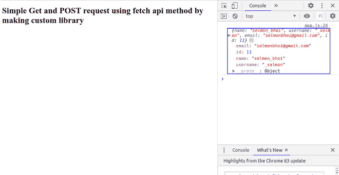

# 通过定制 HTTP 库使用 Fetch API 方法进行简单的 GET 和 POST 请求

> 原文:[https://www . geesforgeks . org/simple-get-post-request-use-fetch-API-method-by-making-custom-http-library/](https://www.geeksforgeeks.org/simple-get-and-post-request-using-fetch-api-method-by-making-custom-http-library/)

**fetch()** 方法用于在不刷新页面的情况下向服务器发送请求。它是 **XMLHttpRequest** 对象的替代品。我们将以一个虚拟的应用编程接口为例，它将包含一个数组的数组，我们将通过创建自定义的 HTTP 库，通过 Fetch API 方法显示 GET 和 POST 数据。

**使用的原料药:**[https://jsonplaceholder.typicode.com/users](https://jsonplaceholder.typicode.com/users)

或者

[https://api.github.com/users](https://api.github.com/users)。
两者你都可以用。

**先决条件:**HTML、CSS、JavaScript 知识。

**方法:**首先，创建一个**“index . html”**文件，并编写以下代码。这个**“index . html”**文件包括**“library . js”**和**“app . js”**文件在“body”标签的下方。在**“library . js”**文件中，首先创建一个 ES6 类 *EasyHTTP* ，在该类中，有一个异步 **fetch()** 函数从该 API URL 中获取数据。等待有两个阶段。首先为 **fetch()** 方法，然后为其响应。无论程序员收到什么响应，都会在**“app . js”**文件的调用函数中返回。

在**【app . js】**文件中，实例化 *EasyHTTP* 类。通过**获取**原型函数，将网址发送到**【library . js】**文件。有两个*承诺*需要解决。第一个用于任何响应数据，第二个用于任何错误。

**注意:**要获得 GET 请求响应，必须在“library.js”文件和“app.js”文件中对 POST 请求部分进行注释。同样，为了获得 POST 请求响应，您必须在“library.js”和“app.js”文件中注释 GET 请求部分。

**index.html**代码中显示了“index.html”的实现。

## 超文本标记语言

```html
<!DOCTYPE html>
<html lang="en">

<head>
    <meta charset="UTF-8">
    <meta name="viewport" content=
        "width=device-width, initial-scale=1.0">
    <meta http-equiv="X-UA-Compatible" content="ie=edge">
    <title>Get and Post request</title>
</head>

<body>

    <h1>Simple Get and POST request using fetch API
        method by making custom library</h1>

    <!-- Including library.js file and app.js file -->
    <script src="library.js"></script>
    <script src="app.js"></script>
</body>

</html>
```

**library.js** 该文件包含以下代码。

## java 描述语言

```html
class EasyHTTP {

    // Make an HTTP GET Request 
    async get(url) {

        // Awaiting for fetch response
        const response = await fetch(url);

        // Awaiting for response.json()
        const resData = await response.json();

        // Returning result data
        return resData;
    }

    // Make an HTTP POST Request
    async post(url, data) {

        // Awaiting for fetch response and 
        // defining method, headers and body  
        const response = await fetch(url, {
            method: 'POST',
            headers: {
                'Content-type': 'application/json'
            },
            body: JSON.stringify(data)
        });

        // Awaiting response.json()
        const resData = await response.json();

        // Returning result data
        return resData;
    }
}
```

**app.js** 文件包含以下代码。

## java 描述语言

```html
// Instantiating EasyHTTP
const http = new EasyHTTP;

// Get prototype method 
http.get('https://jsonplaceholder.typicode.com/users')

    // Resolving promise for response data
    .then(data => console.log(data))

    // Resolving promise for error
    .catch(err => console.log(err));

// Data for post request
const data = {
    name: 'selmon_bhoi',
    username: '_selmon',
    email: 'selmonbhoi@gmail.com'
}

// Post prototype method 
http.post(
    'https://jsonplaceholder.typicode.com/users',
    data)

    // resolving promise for response data
    .then(data => console.log(data))

    // resolving promise for error
    .catch(err => console.log(err));
```

**输出:**显示 GET 请求的输出。
在浏览器中运行**“index . html”**文件，然后右击- > inspect element- >控制台以下输出，你会看到针对 GET 的请求。



**输出:**显示开机自检请求的输出。在浏览器中运行**“index . html”**文件，然后右击- > inspect element- >控制台下面的输出，你会看到对于 POST 请求。

